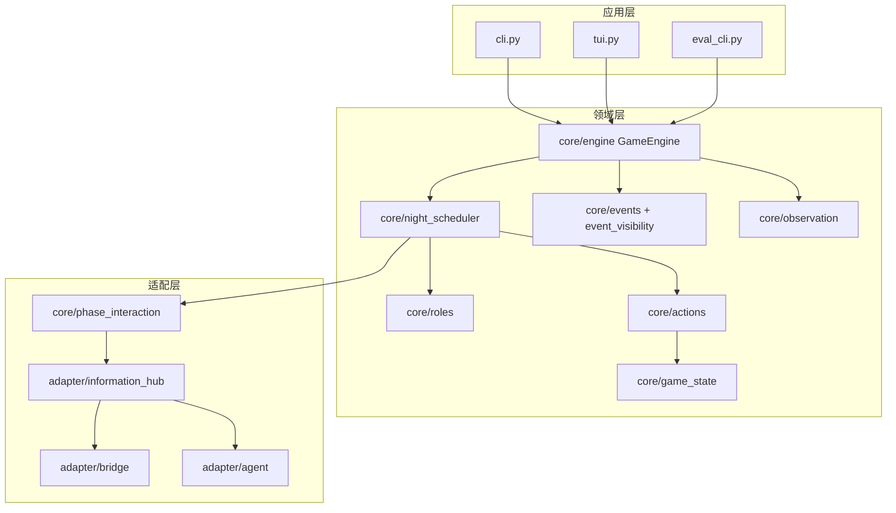

# Architecture

LLM 狼人杀项目的整体架构。

> 文档索引：[README.md](./README.md)  
> 职责与可见性：[project-governance.md](./project-governance.md)

路径均相对 `src/llm_werewolf/`。

## 整体分层

1. **应用层** — `cli.py` / `tui.py` / `eval_cli.py`
2. **领域层** — 规则、状态、阶段编排、Action 执行
3. **适配层** — LLM、MsgHub、Prompt、座位解析（**禁止**在 `roles/` 直接调模型）
4. **状态与事件** — `GameState` + `EventLogger`（复盘与观察的单一事实源）

## 夜间技能顺序

`NightPhaseMixin` 委托 `core/night_scheduler.NightSkillScheduler`：

1. 狼队 **讨论**（`SpeechDecision`，非选刀）
2. **pre-wolf** 批次（丘比特 / 梦魇 / 守卫…）→ `process_actions`
3. **狼人投票** 批次 → `process_actions` → `_resolve_werewolf_votes`（写入 `werewolf_target`）
4. **post-wolf** 批次：女巫（有解药时可见刀口，`WitchNightDecision`：救人/毒人/不行动）→ 预言家 / 守墓人 / 乌鸦等 → `process_actions`
5. `resolve_deaths`

核心四角色（狼/女巫/守卫/预言家）的 LLM 调用集中在 `core/role_night_plans.py`。

## 引擎：Mixin 组合

`GameEngine` 主类不写代码，只多继承 7 个 Mixin：

- `NightPhaseMixin` — 夜晚阶段（狼谈 + NightSkillScheduler）
- `SheriffElectionMixin` — 警长竞选（仅第一晚后）
- `DayPhaseMixin` — 白天发言
- `VotingPhaseMixin` — 白天投票
- `DeathHandlerMixin` — 死亡处理（狼刀/毒/恋人殉情/猎枪/警徽转移）
- `ActionProcessorMixin` — 行动优先级排序与执行
- `GameEngineBase` — 初始化与 `play_game` 主循环

`play_game()` 主循环按 `SETUP → NIGHT → [SHERIFF_ELECTION] → DAY_DISCUSSION → DAY_VOTING → ...` 推进阶段，每个阶段后检查胜负。

选择 Mixin 而非单一类的理由：见 [ADR-0001](adr/0001-mixin-engine.md)。

## 角色系统

20+ 角色分三大阵营，全部继承 `core/roles/base.py` 的 `Role` 抽象基类，实现 `get_config()` 与 `async get_night_actions()`：

- **狼人阵营**（`core/roles/werewolf.py`）：Werewolf / AlphaWolf / WhiteWolf / WolfBeauty / GuardianWolf / HiddenWolf / NightmareWolf / BloodMoonApostle
- **村民阵营**（`core/roles/villager.py`）：Villager / Seer / Witch / Hunter / Guard / Idiot / Elder / Knight / Magician / Cupid / Raven / GraveyardKeeper
- **中立**（`core/roles/neutral.py`）：Thief / Lover / WhiteLoverWolf

角色注册由 `core/role_registry.py` 维护名字到类的映射。

## Action 系统：Command 模式

每个夜间行动是一个 Action 子类（`VoteAction` / `WerewolfVoteAction` / `SeerCheckAction` 等），实现 `validate()` 与 `execute()`。`ActionProcessorMixin` 按 `ActionPriority` 降序执行：

| 优先级 | 角色 |
|---|---|
| 100 | Cupid（首夜连恋）|
| 98 | Nightmare Wolf（封禁）|
| 95 | Thief |
| 90 | Guard / Guardian Wolf |
| 80 | Werewolf（投票杀人）|
| 75 | White Wolf（额外杀同伴）|
| 70 | Witch（解药/毒药）|
| 60 | Seer |
| 50 | Graveyard Keeper |
| 40 | Raven |

被 Nightmare Wolf 封禁的演员行动直接跳过。

## Agent 与信息中枢

- **门面**：`PhaseInteraction` → `InformationHub`（MsgHub 通道：`PUBLIC` / `WOLF_TEAM` / `PRIVATE`）
- **解析**：`WerewolfAdapterBridge`（座位号、`[[发言]]` / `{内心}`、结构化输出）
- **实现**：`core/agent.py`（Demo/Human/LLM）、`adapter/agent.py`（AgentScope）

引擎与角色**不得**绕过 Hub 直接 `agent.get_response()`（扩展狼角色仍在迁移至 `role_night_plans`）。

见 [ADR-0002](adr/0002-protocols-over-abc.md)、[ADR-0005](adr/0005-night-skill-scheduler.md)。

## 信息隔离

两层防御保证玩家只能看到允许看到的信息：

1. **`Event.visible_to`** — 事件自带可见性列表（`None` 表示全员可见，列表表示仅特定玩家）。`EventLogger.get_events_for_player(pid)` 自动过滤。
2. **`Role.get_private_notes(game_state)`** — 每个角色实现自己的"私密笔记"方法：
   - Werewolf → 队友名单
   - Seer → 历史查验结果
   - Witch → 今晚狼刀目标 + 药剂剩余
   - Guard → 上一夜保护的人

`ObservationBuilder`（`core/observation.py`）把公共状态 + 可见事件 + 私密笔记拼成单玩家提示词。

## 异步

所有阶段方法（`play_game` / `run_night_phase` / `run_day_phase` 等）都是 `async`；`LLMAgent` 用 `AsyncOpenAI` 并发友好。无 IO 的方法（`_log_event`、状态读取）保持同步。

理由：见 [ADR-0003](adr/0003-async-engine.md)。

## 配置

`configs/*.yaml` 通过 `PlayersConfig`（Pydantic）反序列化，含玩家名、模型、API 设置。

`GameConfig` 由 `create_game_config_from_player_count(n)` 按人数自动生成：

- 6–8 人：2 狼 + Seer/Witch + Villager
- 9–11 人：+AlphaWolf + Guard + Hunter
- 11+：+Cupid
- 12–14 人：+WhiteWolf
- 13+：+Idiot
- 15+ 人：+WolfBeauty + Elder
- 17+：+Knight
- 19+：+Raven

剩余位补 Villager。

## 本地化

`core/locale.py` 中 `Locale.MESSAGES` 字典维护三语模板（en-US / zh-TW / zh-CN）。`Locale.get(key, **kwargs)` 返回格式化后的字符串。引擎在生成事件消息时统一走 Locale，UI 层不做翻译。

## 序列化

`core/serialization.py` 将 `GameState` 通过 `GameStateSnapshot`（Pydantic）扁平化为 JSON。逐角色提取私有状态（Witch 药剂、Guard `last_protected`、Cupid `has_linked` 等）。Agent 不序列化，恢复时通过 `agent_factory: dict[player_id, agent]` 重注入。

## 包结构补充（2026-05）

- `agents/`、`integration/`：玩家工厂与 AgentScope
- `core/prompts/`：统一中文 Prompt 与 `ActionSelector`
- `core/roles/catalog.py`：角色四元组，`implementation` 为 `module:Class` 路径
