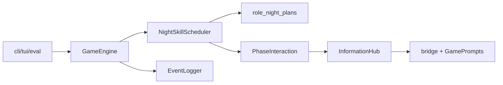

# 架构迁移记录（历史）

> **当前权威文档**：[project-governance.md](./project-governance.md)、[project-master-plan.md](./project-master-plan.md)、[arch.md](./arch.md)。

本文档保留早期「预设架构 → 目标架构」迁移背景，**不再作为日常开发依据**。

## 已完成的迁移（2026-05-20）

| 项 | 结果 |
|----|------|
| `ActionSelector` | 已删除；由 `PhaseInteraction` + `InformationHub` + `WerewolfAdapterBridge` 替代 |
| 讨论双写 history | 已删除；观察仅从 `Event` 重建 |
| `InformationHub._active` | 已移除；`GameEngine` 显式注入 |
| 座位号解析 | `WerewolfAdapterBridge` 按全局座位 `player_N` |
| 夜间技能顺序 | `NightSkillScheduler`：守卫等 → 狼票结算 → 女巫 → 其余 |
| Event 可见性 | `event_visibility.resolve_visible_to` + `_log_event` 默认 |

## 仍待办（见 master-plan）

- 扩展狼角色迁入 `role_night_plans.py`
- `GamePrompts` 全面接入 Hub 各阶段入口
- MsgHub 层评测（E1）
- Web 观战 / 信念矩阵（远期）

## 目标架构简图

座位编号约定：响应中的数字表示**全局座位号**（`player_2` → 座位 2），不是候选列表下标。
