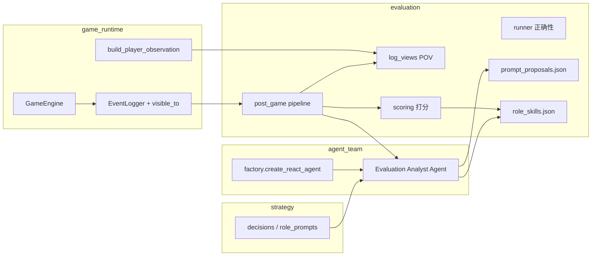

# 评测模块优化设计（Evaluation v2）

> **状态**：deprecated
> **替代文档**：[DESIGN.md](../../evaluation/DESIGN.md)
> **说明**：Phase 1/2 历史讨论稿；现行设计以 DESIGN 为准，请勿再更新本文。

> **读者**：全体队友（规则 / Agent / Prompt / 评测分工均可对照）
> **吕祎晗修改记录**：[吕祎晗-修改记录.md](../archive/%E5%90%95%E7%A5%8E%E6%99%97-%E4%BF%AE%E6%94%B9%E8%AE%B0%E5%BD%95.md)（队友速览）

---

## 1. 背景与目标

### 1.1 现状（Evaluation v1）

| 能力            | 实现                                   | 缺口                                            |
| --------------- | -------------------------------------- | ----------------------------------------------- |
| 离线正确性      | `runner` + `checkers` + DemoAgent      | 不测真实 LLM 质量                               |
| 投票摇摆        | `vote_swing_analysis`                  | 无阵营收益、无与最终票型/胜负联动打分           |
| 阵营匹配说服    | `camp_persuasion`                      | 仅统计 swing，未进 Skill 提取                   |
| PostGame 自动跑 | `post_game/pipeline`                   | 已接入 finalize_run                             |
| Prompt 提案     | `prompt_proposals.json`                | 仅规则 + 少量 bad case；LLM 建议未结构化进 JSON |
| LLM 复盘        | `replay_agent.py`                      | **AsyncOpenAI 旁路**，需改为 AgentScope         |
| Skill 提取      | 无                                     | —                                               |
| 日志视角        | 全量 `events.jsonl` / `game_replay.md` | 无按 `visible_to` 的 POV 视图，Token 浪费       |
| 打分体系        | 无统一 Agent 收益分                    | 无法支撑「高分 Agent → 抽 Skill」               |

### 1.2 v2 目标（本设计）

1. **AgentScope 调用**：PostGame 内所有 LLM（复盘、Skill 提取、后续打分解释）经 `agent_team.factory` 创建单 Agent 执行。
2. **双产物 JSON**：

- `prompt_proposals.json`（延续，结构化 Prompt 补丁提案）
- `role_skills.json`（新增，按 **身份 / prompt_role_key** 划分的 Skill 卡片）

1. **日志可见性视图**：按需求生成多种「读日志」切片，支持 **当局者 POV**，节省 Token。
2. **打分系统**：完善意向改变 + 预留 **收益分（Benefit Score）**；**Phase 1 全量 Skill 提取**，Phase 2 再按高分筛选。
3. **团队对齐**：模块边界清晰、产物 schema 稳定、与《发现问题》已知项挂钩。

---

## 2. 模块边界（六模块不变）



| 模块           | v2 职责                                                         | 禁止                                |
| -------------- | --------------------------------------------------------------- | ----------------------------------- |
| `evaluation`   | 赛后流水线、视图、打分、JSON 产物、批量 eval                    | 直接 `AsyncOpenAI`；改运行时 Prompt |
| `agent_team`   | 提供 **Evaluation 专用** ReActAgent 工厂封装（可 thin wrapper） | 把评测 Prompt 散落到 factory        |
| `strategy`     | Skill / 复盘 的 **输出 JSON Schema**（Pydantic）                | 评测业务逻辑                        |
| `game_runtime` | 事件 `visible_to`、observation 构建（只读复用）                 | PostGame 逻辑                       |
| `interface`    | finalize_run 触发；可选 `werewolf-post-game` CLI                | —                                   |

---

## 3. PostGame 流水线（v2）

### 3.1 阶段顺序

```
对局结束 finalize_run
  ├─ [规则] 持久化 events / vote_intentions（已有）
  ├─ [规则] vote_swing + camp_persuasion（已有，接入 scoring 输入）
  ├─ [规则] checkers 摘要（可选，从 events 跑 PromptBadCase 等）
  ├─ [规则] log_views 生成（新增，见 §4）
  ├─ [规则] scoring 计算（新增/增强，见 §5）
  ├─ [LLM] EvaluationAgent：复盘 + Prompt 提案 enrich（AgentScope）
  ├─ [LLM] SkillExtractor：按身份 Skill 提取（AgentScope，Phase 1 全量）
  └─ [规则] 写 manifest + 更新 prompt_tuning 索引（可选人工）
```

### 3.1.1 情景记忆对接（2026-05-28）

| 模块                           | 说明                                                                                   |
| ------------------------------ | -------------------------------------------------------------------------------------- |
| `post_game/event_adapter.py`   | `events.jsonl` ↔ `Event` / `EventLogger`                                               |
| `post_game/episodic_bridge.py` | 复用 `EpisodicMemory.export_episode_report`，写出 `episodic_reports.json`              |
| `post_game/coach/coach.py`     | 为 `role_skills[]` 附加 `evidence.episodic_excerpt`，写出 `coach_summary.json`         |
| 运行时                         | `MemoryManager.episodic` 仍在对局内按 POV 积累；PostGame 离线复盘与运行时 **同一 API** |

### 3.2 AgentScope 接入（需求 1）

| 项            | 设计                                                                                                                        |
| ------------- | --------------------------------------------------------------------------------------------------------------------------- |
| Agent 数量    | **1 个**「评测分析师」ReActAgent（可单轮 structured output，不必多轮 ReAct）                                                |
| 创建方式      | `evaluation/post_game/eval_agent.py` 调用 `agent_team.factory.create_react_agent`                                           |
| 配置来源      | 与对局相同 YAML 的 `players[0]`，或新增 `evaluation:` 段（`model` / `base_url` / `api_key_env`）                            |
| System Prompt | 固定「评测分析师」身份，不绑定狼人杀座位                                                                                    |
| 结构化输出    | `ReplayAnalysisDecision` 等 Pydantic 模型；`eval_agent._parse_replay_decision` 依次读 metadata、`tool_use.generate_response.input`、文本 JSON（与对局 Agent 同源） |
| 删除          | `replay_agent.py` 内 `AsyncOpenAI`（实现 v2 时移除）                                                                        |

**与对局 Agent 隔离**：不复用玩家 `agentscope_agent` 实例；评测 Agent **无** MsgHub 圆桌，单次 prompt 输入压缩后的视图文本。

---

## 4. 日志可见性视图（需求 3）

### 4.1 动机

- 全量 `game_replay.md` / 原始 events 含 **上帝视角 + 私密事件**，直接喂 LLM 浪费 Token，且不符合「站在当局者角度复盘」。
- 运行时已有 `Event.visible_to` 与 `EventLogger.get_events_for_player`（见 `game_runtime/events.py`），评测层应 **只读复用**，不 duplicate 规则。

### 4.2 视图类型（`evaluation/log_views/`）

| 视图 ID             | 读者         | 内容                                                         | 用途                              |
| ------------------- | ------------ | ------------------------------------------------------------ | --------------------------------- |
| `god`               | 评测 / 裁判  | 全量 events（可截断 thinking 噪声）                          | 正确性 checker、终局身份对照      |
| `player:{id}`       | 当局者 POV   | `visible_to` 过滤后的时间线 + 该玩家私密笔记（若 events 含） | Skill 提取、POV 复盘              |
| `role:{prompt_key}` | 同身份聚合   | 该身份所有存活玩家的 POV 并集（或选代表 seat）               | 按身份写 Skill                    |
| \`camp:{werewolf    | villager}\`  | 阵营                                                         | 公开事件 + 该阵营成员可见私密事件 |
| `public_digest`     | LLM 输入默认 | 仅公开讨论 + 投票结果 + 死亡公告                             | Token 最省的全局摘要              |
| `swing_digest`      | LLM 输入     | vote_intention 快照 + camp_persuasion 高影响条目             | 说服 / Prompt 优化                |

### 4.3 产物

```text
runs/<id>/
  views/
    god_timeline.jsonl
    player_player_3_timeline.md
    public_digest.md
    swing_digest.json
  views_manifest.json    # 各视图路径、token_estimate、生成参数
```

### 4.4 Token 控制策略

- 每条 event 写入视图前：**截断** `message` 超长字段、**剔除** AgentScope thinking dump（对局 log 中的 `thinking` 块）。
- 按 `round_number` / `phase` 分块，超预算时 **保留**：死亡、投票、技能结果、PLAYER_SPEECH、VOTE_INTENTION_SNAPSHOT。
- LLM 调用默认输入：`public_digest` + `swing_digest` + **单身份** `player:{id}` 片段（Skill 提取时）。

### 4.5 与《发现问题》关系

- **问题 6**（event 双轨）：视图只读 `EventLogger` 导出；中期存档统一后视图生成不变。
- **问题 8.2**（刀口可见性）：POV 视图必须 respect `visible_to`，用于验证信息隔离评测。

---

## 5. 打分系统（需求 4）

### 5.1 设计原则

- **规则层先算、LLM 后解释**：分数由确定性逻辑产生，LLM 只写 Skill/复盘文案，避免「模型自己给自己打分」。
- **阵营相对**：同一指标对狼/好人含义不同（v1 `camp_persuasion` 已起步）。
- **Phase 1**：实现基础分 + **全量 Skill 提取**；**Phase 2** 再 `score >= threshold` 才提取。

### 5.2 意向改变分（Intention Score）— 增强

在现有 `vote_swing` + `camp_persuasion` 上扩展：

| 指标                  | 说明                                         |
| --------------------- | -------------------------------------------- |
| `swing_count`         | 发言引起的意向变更次数（已有）               |
| `camp_aligned_swings` | 变更方向是否符合 **发言者阵营** 利益（已有） |
| `matched_elimination` | 变更是否指向当轮出局者（已有）               |
| `swing_to_final_vote` | **新增**：变更后意向是否与该玩家最终投票一致 |
| `persuasion_net`      | **新增**：同阵营听众 swing 加权求和          |

输出：`intention_scores.json`（按 speech、按 player 聚合）。

### 5.3 收益分（Benefit Score）— 预留

按 **Agent / 玩家** 聚合「对己方阵营有正向收益的行为」。Phase 1 可 **先出 schema + 空实现或部分规则**，Phase 2 填满。

| 行为类别 | 示例事件                                        | 狼人收益     | 好人收益     |
| -------- | ----------------------------------------------- | ------------ | ------------ |
| 夜间击杀 | `werewolf_killed`                               | +            | —            |
| 放逐投票 | `player_eliminated`                             | 推好人 +     | 推狼 +       |
| 技能命中 | `seer_checked`, `witch_save`, `guard_protected` | 视目标阵营   | 视目标阵营   |
| 发言说服 | `camp_aligned_swings`                           | 推好人       | 推狼         |
| 存活轮次 | 终局存活                                        | 视胜负       | 视胜负       |
| 胜负     | `game_ended`                                    | 阵营赢 +大量 | 阵营赢 +大量 |

输出：`benefit_scores.json`（`player_id`, `role`, `camp`, `breakdown`, `total`）。

**Phase 1 实现范围（建议）**：

- 实现 `intention_scores` 完整规则。
- `benefit_scores` 仅实现：`game_won`、`elimination_aligned`、`camp_persuasion_sum` 三项占位。
- Skill 提取 **不筛分**，对所有有发言/行动记录的身份 **全量调用** LLM。

### 5.4 与 Skill 提取的关系

| 阶段                    | 策略                                                                                |
| ----------------------- | ----------------------------------------------------------------------------------- |
| **Phase 1（当前目标）** | 每个 `prompt_role_key` 至少 1 条 Skill 候选（有素材则提取，无则 `status: skipped`） |
| **Phase 2**             | 仅 `benefit_total >= T` 或 `intention_score >= T` 的 player/identity 进入 Skill LLM |
| **Phase 3**             | Skill 写入 strategy 版本库（与 prompt_proposals 类似，JSON draft）                  |

---

## 6. 双 JSON 产物（需求 2）

### 6.1 `prompt_proposals.json`（延续 + 增强）

**Schema**：`prompt_proposals_v1` → 升级为 `v2`（兼容读取 v1）

| 字段              | 说明                                                       |
| ----------------- | ---------------------------------------------------------- |
| `proposals[]`     | 规则 bad case + camp 高影响发言 + **LLM 结构化补丁**       |
| `proposal.kind`   | `positive_persuasion` / `bad_case_rule` / `llm_suggestion` |
| `suggested_patch` | `section`, `action`, `text_zh`                             |
| `evidence`        | 链接 `run_dir`、`speech_id`、checker、视图 snippet         |
| `apply_policy`    | 固定 `json_only_no_runtime_replace`                        |

### 6.2 `role_skills.json`（新增）

**Schema**：`role_skills_v1`

```json
{
  "schema": "role_skills_v1",
  "run_dir": "runs/...",
  "prompt_version_base": "v2",
  "winner_camp": "werewolf",
  "extraction_mode": "full",
  "skills": [
    {
      "skill_id": "wolf_r1_self\u5200\u9a97\u836f\u8ba8\u8bba",
      "prompt_role_key": "wolf",
      "source_player_id": "player_1",
      "source_player_name": "\u73a9\u5bb61",
      "game_role_name": "Werewolf",
      "camp": "werewolf",
      "status": "draft",
      "quality_gate": {
        "passed": true,
        "reason": "Phase1 \u5168\u91cf\u63d0\u53d6\uff1b\u672c\u5c40\u72fc\u961f\u591c\u804a\u6709\u5b8c\u6574\u6218\u672f\u94fe"
      },
      "skill_card": {
        "title_zh": "\u9996\u591c\u81ea\u5200\u9a97\u836f\u534f\u5546",
        "when_to_use": "\u9996\u591c\u3001\u5973\u5deb\u672a\u7528\u836f\u4fe1\u606f\u672a\u77e5\u3001\u72fc\u961f\u53ef\u7edf\u4e00\u53e3\u5f84",
        "public_behavior": "\u591c\u804a\u4e2d\u5411\u961f\u53cb\u8bf4\u660e\u81ea\u5200\u6536\u76ca\u4e0e\u767d\u5929\u8eab\u4efd\u8def\u7ebf",
        "avoid": "\u5728\u4e0d\u53ef\u81ea\u5200\u7684\u76ee\u6807\u5217\u8868\u91cc\u5f3a\u884c\u9009\u81ea\u5df1\u5ea7\u4f4d"
      },
      "evidence": {
        "view_ref": "views/player_player_1_timeline.md",
        "event_refs": [
          "round_1/night/wolf_discussion"
        ],
        "scores": {
          "intention": 0,
          "benefit": null
        }
      },
      "rationale": "AgentScope \u63d0\u53d6\u6458\u8981"
    }
  ]
}
```

**「是否有比较好发挥」判定（Phase 1 简化）**

| 条件                                                  | 处理                                                       |
| ----------------------------------------------------- | ---------------------------------------------------------- |
| 该身份有 ≥1 条非空 `public_speech` 或有效夜间决策事件 | `quality_gate.passed = true`，进入 LLM 提取                |
| 全程 fallback / 空发言                                | `status: skipped`，`reason: insufficient_material`         |
| Phase 2+                                              | 叠加 `benefit_total >= T`（**筛选**，当前未启用）          |
| 未通过生成规则的身份                                  | **不写入** `skills[]` / MD；仅在 `skipped_identities` 摘要 |

按 **身份划分**：以 `PromptManager.get_prompt_role_key(game_role_name)` 为桶（`wolf`, `prophet`, `witch`, …），同桶多玩家可多条 Skill。

**Markdown 落盘（2026-05-25 已实现 Phase 1）**

| 位置                            | 说明                                            |
| ------------------------------- | ----------------------------------------------- |
| `runs/<id>/role_skills.json`    | 索引 + 元数据                                   |
| `runs/<id>/skills/*.md`         | 本局 Skill 归档                                 |
| `agent_team/skills/<role>/*.md` | Agent 运行时加载库（PostGame 同步写入 `draft`） |

运行时由 `skill_loader.select_skills_for_belief` 按信念矩阵匹配 Skill，注入 decision context（不在 system prompt 灌全文）。

---

## 7. 目录与文件规划

```text
src/llm_werewolf/evaluation/
  post_game/
    pipeline.py              # 编排 v2 阶段
    run_context.py           # 已有
    camp_persuasion.py       # 已有
    prompt_proposal.py       # 增强
    eval_agent.py            # 新增：AgentScope 评测 Agent
    skill_extractor.py       # 新增：按身份 Skill LLM + 规则门控
    replay_agent.py          # 废弃 AsyncOpenAI → 合并入 eval_agent
  log_views/
    __init__.py
    builder.py               # 视图构建
    filters.py               # visible_to / 截断
  scoring/
    __init__.py
    intention.py             # 意向分增强
    benefit.py               # 收益分（Phase 1 部分）
    models.py                # Score* dataclass / pydantic
  runner.py                  # 不变：Demo 正确性
  checkers.py                # 不变
  ...

strategy/
  evaluation_outputs.py      # 新增：ReplayAnalysis, SkillCard 等 schema

docs/
  吕祎晗-评测模块优化设计.md   # 本文
  prompt_tuning.md           # 人类可读变更记录（链接 JSON 依据）
```

---

## 8. 实施分期与进度（给队友对表）

| 期     | 内容                                                            | 负责人建议    | 状态                |
| ------ | --------------------------------------------------------------- | ------------- | ------------------- |
| **P0** | `eval_agent.py` AgentScope 替换 `AsyncOpenAI`；复盘 JSON schema | 评测 + Agent  | ✅ 已实现           |
| **P1** | `log_views/` POV + digest + manifest                            | 评测          | ✅ 已实现           |
| **P1** | `intention_scores.json` 增强                                    | 评测          | ✅ Phase1 规则      |
| **P1** | `role_skills.json` 全量提取 + `skill_extractor` + Skill MD 双写 | 评测 + Prompt | ✅ Phase1 规则 + MD |
| **P1** | `prompt_proposals_v2` + `target_variable`                       | Prompt        | ✅ 已实现           |
| **P2** | `benefit_scores.json` 完整规则                                  | 评测 + 规则   | 🔄 Phase1 三项占位  |
| **P2** | 按高分筛选 Skill；`prompt_comparison.md` 自动生成               | Prompt        | ⬜ 预留             |
| **P2** | eval runner 可选真实 LLM 对局 + PostGame                        | 评测          | ⬜ 预留             |

---

## 9. 已知问题与风险（对接《发现问题》）

| #   | 问题                                  | 对评测 v2 的影响                        | 缓解                                                        |
| --- | ------------------------------------- | --------------------------------------- | ----------------------------------------------------------- |
| 4   | PlayerConfig 文档与 AgentScope 不一致 | YAML 配置评测 Agent 时易混淆            | 文档同步；可选独立 `evaluation` YAML 段                     |
| 6   | 事件双轨未统一                        | 读档后 PostGame 可能缺 events           | finalize_run 强制写 `events.jsonl`；长期 snapshot 含 events |
| 6   | 读档丢事件                            | 离线 PostGame 依赖 run 目录完整性       | views 生成前检查 manifest                                   |
| 7   | game_runtime ↔ agent_team 耦合        | 评测 **只读** observation，不加深耦合   | log_views 复制 `visible_to` 规则，不 import Hub             |
| 8.8 | 狼队 visible_to 不统一                | POV 视图与真实玩家所见可能偏差          | `god` 与 `player` 视图对比进 checker（可选）                |
| —   | 对局 log 含大量 thinking              | Token 爆炸                              | views 层强制 strip thinking                                 |
| —   | Demo eval 与 LLM 对局脱节             | werewolf-eval 无法测 Skill 质量         | 区分 `correctness` 与 `quality` 两条 pipeline               |
| —   | PostGame 耗时长                       | 9 人局 LLM 复盘 + 多身份 Skill 多次调用 | 默认 1 次复盘 + N 身份并行上限；可 `skip_skill_llm`         |

---

## 10. 配置与 CLI（草案）

```yaml
# configs/llm-9p-doubao.yaml 末尾可选
evaluation:
  analyst_model: *doubao_ep
  analyst_base_url: *doubao_base
  analyst_api_key_env: ARK_API_KEY
  post_game:
    skip_llm: false
  skill_extraction:
    mode: full          # full | scored_only (Phase 2)
    min_benefit_score: 0  # Phase 2 启用
  log_views:
    default_llm_input: [public_digest, swing_digest]
    max_events_per_view: 200
```

```powershell
# 仅对已有 run 重跑 PostGame v2
uv run werewolf-post-game runs/doubao-9p-xxx --config configs/llm-9p-doubao.yaml
```

（CLI 名可在 P0 一并添加。）

---

## 11. 测试策略

| 类型 | 内容                                                 |
| ---- | ---------------------------------------------------- |
| 单元 | `log_views` 对 synthetic events 的 `visible_to` 过滤 |
| 单元 | `intention` / `benefit` 打分与 fixture jsonl 快照    |
| 单元 | Skill schema 校验；`quality_gate` 跳过逻辑           |
| 集成 | mock AgentScope eval agent，pipeline 写出双 JSON     |
| 回归 | 现有 23 个 evaluation tests 保持通过                 |

---

## 12. 队友快速 FAQ

**Q：评测会改运行时 Prompt 吗？**
A：不会。仅写 `prompt_proposals.json` / `role_skills.json` draft。

**Q：Skill 和 Prompt 提案区别？**
A：提案改 **系统提示/策略卡**；Skill 是可复用的 **行为模式卡片**（何时用、怎么说、避免什么），按身份归档。

**Q：为什么 POV 视图重要？**
A：与玩家实际 information 一致，Skill 才「可执行」；也省 Token。

**Q：Demo 局会跑 Skill LLM 吗？**
A：Phase 1 若 `skip_llm=True` 则只出规则和空 Skill 占位；真实 LLM 对局才全量提取。

**Q：OpenAI 官方 API？**
A：评测 LLM 只走 AgentScope + YAML `base_url`；不新增 OpenAI SDK 直连（见 OpenAI 接口分析 doc）。

---

## 13. 相关文档索引

| 文档                                                                                                                                                     | 用途                   |
| -------------------------------------------------------------------------------------------------------------------------------------------------------- | ---------------------- |
| [工程架构重构计划.md](./%E5%B7%A5%E7%A8%8B%E6%9E%B6%E6%9E%84%E9%87%8D%E6%9E%84%E8%AE%A1%E5%88%92.md)                                                     | 六模块职责             |
| [吕祎晗-发现问题.md](./%E5%90%95%E7%A5%8E%E6%99%97-%E5%8F%91%E7%8E%B0%E9%97%AE%E9%A2%98.md)                                                              | 已知 bug / 待决策      |
| [prompt_tuning.md](./prompt_tuning.md)                                                                                                                   | Prompt 版本与人工复盘  |
| [OpenAI 接口与可删除性分析.md](./%E5%90%95%E7%A5%8E%E6%99%97-OpenAI%E6%8E%A5%E5%8F%A3%E4%B8%8E%E5%8F%AF%E5%88%A0%E9%99%A4%E6%80%A7%E5%88%86%E6%9E%90.md) | 禁止 AsyncOpenAI 旁路  |
| `evaluation/README.md`                                                                                                                                   | 使用说明（实现后同步） |

---

*文档版本：v0.1 · 2026-05-25 · 作者：评测模块优化讨论稿*
