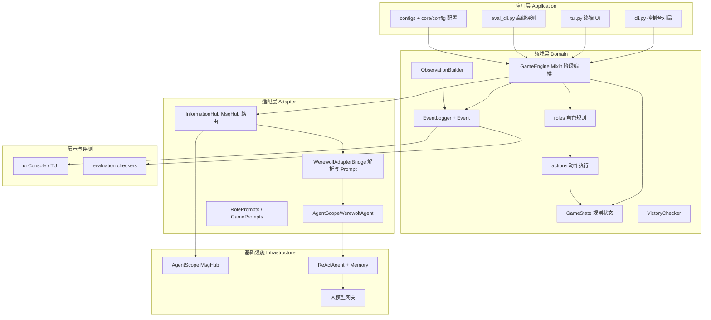

# MultiAgent-Werewolf 项目治理文档

> 版本：2026-05-20
> 目的：固定**职责边界**、**阶段归属**、**事件可见性**，作为后续重构与 Code Review 的单一依据。
> 实施索引：[project-master-plan.md](./project-master-plan.md)。历史迁移：[architecture-improvement.md](./architecture-improvement.md)。

---

## 1. 文档怎么用

| 读者   | 用法                                                         |
| ------ | ------------------------------------------------------------ |
| 开发   | 改代码前查「§4 阶段归属」「§6 Event 可见性表」，避免跨层调用 |
| Review | 对照「§3 禁止混用」与「§7 当前偏差」                         |
| 重构   | 按「§8 实施顺序」逐项消减偏差                                |

**三条铁律**

1. **规则与状态**只在领域层（`GameState` / `Role` / `Action`）。
2. **Agent 与 LLM**只经适配层 `InformationHub` → `WerewolfAdapterBridge`。
3. **谁能知道什么**由 `Event.visible_to` + `VisibilityChannel` 双轨一致表达，禁止第四套「手写 history」长期并存。

---

## 2. 分层架构（目标形态）



---

## 3. 模块职责矩阵

| 模块     | 路径                                | 唯一职责                         | 禁止                                    |
| -------- | ----------------------------------- | -------------------------------- | --------------------------------------- |
| 配置     | `configs/*.yaml`, `core/config/`    | 人数、角色表、模型端点           | 调 LLM、改阶段                          |
| 游戏状态 | `core/game_state.py`                | 阶段枚举、回合、票型、夜间字段   | Agent 调用、拼 prompt                   |
| 阶段编排 | `core/engine/*_phase.py`, `base.py` | 顺序执行阶段、写事件、调 Hub     | 解析 `[[n]]`、直接 `agent.get_response` |
| 角色规则 | `core/roles/*.py`                   | 合法性、产出 `Action` 列表       | 调 LLM、MsgHub、英文任务 prompt         |
| 动作执行 | `core/actions/*.py`                 | `validate` / `execute`、改状态   | 可见性、展示                            |
| 事件日志 | `core/events.py`, `Event`           | 追加事件、`visible_to` 过滤      | Agent 记忆                              |
| 观察视图 | `core/observation.py`               | 某玩家可见事件 + 私密笔记 → 文本 | 调模型                                  |
| 胜负     | `core/victory.py`                   | 终局判定                         | 其它                                    |
| 信息中枢 | `adapter/information_hub.py`        | 全部 Agent I/O、MsgHub 通道      | 改 `GameState`、执行 `Action`           |
| 决策桥   | `adapter/bridge.py`                 | Prompt、结构化解析、座位号       | 阶段顺序                                |
| 玩家代理 | `adapter/agent.py`, `factory.py`    | ReAct 绑定、重试、序列化         | 目标解析、规则                          |
| 话术     | `adapter/prompts.py`                | 中文角色/阶段模板                | 状态机                                  |
| 展示     | `ui/*`                              | 按观众过滤渲染                   | 写规则                                  |
| 评测     | `evaluation/*`                      | 离线检查事件流与隔离             | 真 API 对局主流程                       |

---

## 4. 阶段与行为归属

### 4.1 游戏阶段（`GamePhase`）

| 阶段     | 状态字段 `GameState.phase` | 编排入口                            | Agent 交互（目标）                          | 规则动作                                     |
| -------- | -------------------------- | ----------------------------------- | ------------------------------------------- | -------------------------------------------- |
| 开局     | `setup`                    | `GameEngine.setup_game`             | `factory` 创建 Agent                        | 洗牌、绑角色                                 |
| 夜晚     | `night`                    | `NightPhaseMixin.run_night_phase`   | Hub：旁白 PUBLIC → 狼谈 WOLF → 技能 PRIVATE | `Role.get_night_actions` → `process_actions` |
| 警长竞选 | `sheriff_election`         | `SheriffElectionMixin`              | 报名/投票 PRIVATE；发言 PUBLIC              | —                                            |
| 白天讨论 | `day_discussion`           | `DayPhaseMixin.run_day_phase`       | `run_roundtable(PUBLIC)` 全体 MsgHub        | —                                            |
| 白天投票 | `day_voting`               | `VotingPhaseMixin.run_voting_phase` | `request_private_seat` 逐人 PRIVATE         | `VoteAction`                                 |
| 终局     | `ended`                    | `VictoryChecker`                    | 无                                          | —                                            |

阶段推进**只**由 `GameState.next_phase()` 与 `GameEngine.play_game` 循环负责；Role 不得 `set_phase`。

### 4.2 子行为 → 负责模块（目标）

| 子行为     | 编排                 | Agent/MsgHub                          | 事件                        | 观察             |
| ---------- | -------------------- | ------------------------------------- | --------------------------- | ---------------- |
| 夜晚旁白   | `night_phase`        | `hub.announce(PUBLIC)`                | `PHASE_CHANGED`, `MESSAGE`  | 全员             |
| 狼队讨论   | `night_phase`        | `hub.run_roundtable(WOLF)`            | `PLAYER_DISCUSSION`         | 仅狼人           |
| 预言家验人 | `night_phase` → role | `hub.request_private_seat`            | `SEER_CHECKED`              | 仅预言家         |
| 女巫救/毒  | role                 | `hub.request_private_yes_no` / `seat` | `WITCH_*`                   | 仅女巫           |
| 守卫守护   | role                 | `hub.request_private_seat`            | `GUARD_PROTECTED`           | 仅守卫           |
| 狼人刀口   | role + 结算          | `hub.request_private_seat`            | `WEREWOLF_KILLED`（公布）   | 白天全员         |
| 白天发言   | `day_phase`          | `hub.run_roundtable(PUBLIC)`          | `PLAYER_SPEECH`             | 全员             |
| 放逐投票   | `voting_phase`       | `hub.request_private_seat`            | `VOTE_CAST` / `VOTE_RESULT` | 见 §6            |
| 警长发言   | `sheriff_election`   | `hub.run_roundtable(PUBLIC)`          | `SHERIFF_CANDIDATE_SPEECH`  | 全员             |
| 猎人开枪   | `death_handler`      | `hub.request_private_seat`            | `HUNTER_REVENGE`            | 全员（结果公开） |

---

## 5. 信息三轨模型

对局中的「谁知道什么」必须用下表三轨**对齐**，禁止各写各的。

| 轨道             | 载体                            | 权威用途                             | 消费者                               |
| ---------------- | ------------------------------- | ------------------------------------ | ------------------------------------ |
| **事件轨**       | `Event` + `EventLogger`         | 可复盘日志、评测、UI（按观众过滤）   | `ObservationBuilder`, UI, evaluation |
| **Agent 记忆轨** | AgentScope `MsgHub` + `observe` | ReAct 历史；公开发言广播、内心仅自己 | `InformationHub`                     |
| **角色私密轨**   | `Player.get_private_notes()`    | 验人结果、狼队友、药水状态等规则事实 | `ObservationBuilder`                 |

### 5.1 禁止混用（§3 细则）

| 反模式                                    | 现状                 | 目标                                                 |
| ----------------------------------------- | -------------------- | ---------------------------------------------------- |
| `roles/*` 直接 `ActionSelector`           | 已移除               | Role 经 `PhaseInteraction`；目标：Role 只产 `Action` |
| `public_discussion_history` 与 Event 双写 | 已删                 | 观察仅从 `Event` 重建                                |
| `agent.decision_history` 当记忆           | 仍在使用             | 仅保留摘要；详细以 Event/Hub 为准                    |
| `MessageAdapter.visible_to`               | 未接入               | 删除或并入 Hub                                       |
| `GamePrompts` 未引用                      | 空转                 | 阶段 Prompt 单源                                     |
| `InformationHub._active` 全局 bind        | 已移除               | `GameEngine` → `GameState` 显式注入                  |
| UI 忽略 `visible_to`                      | Console/TUI 全量打印 | 传入 `viewer_id` 过滤                                |

### 5.2 `VisibilityChannel` 与 MsgHub

| 通道        | MsgHub 参与者        | 典型子行为                          |
| ----------- | -------------------- | ----------------------------------- |
| `PUBLIC`    | 全体存活 ReActAgent  | 白天讨论、警长发言、旁白            |
| `WOLF_TEAM` | 存活狼人             | 狼队夜谈                            |
| `PRIVATE`   | 仅当前行动者         | 夜间技能、投票、是/否决策           |
| `CUSTOM`    | 显式 `audience` 列表 | 预留（例如：仅警长竞选候选人+观众） |

**公开发言 / 内心**：`[[...]]` → 通道广播；`{...}` → 仅 `observe` 到本人（见 `bridge.parse_speech`）。

---

## 6. Event 可见性表（完整）

约定：

- **`visible_to = None`**：全体玩家可见（含观战日志、评测默认视角）。
- **`visible_to = [player_id, ...]`**：仅列表内玩家可进入 `ObservationBuilder` 视图。
- **`data.private_thought`**：永不进入公开 `message`；不得出现在他人 observation。
- **已定稿**（2026-05-20）：下列「目标 visible_to」为权威规则；由 `core/event_visibility.py` + `_log_event` 默认解析。

### 6.1 对局生命周期

| EventType       | 触发时机        | 负责模块       | MsgHub 通道     | visible_to（已定稿）                | 备注                                                         |
| --------------- | --------------- | -------------- | --------------- | ----------------------------------- | ------------------------------------------------------------ |
| `game_started`  | `setup_game`    | `base`         | —               | 全体                                |                                                              |
| `game_ended`    | `check_victory` | `base`         | —               | 全体                                |                                                              |
| `phase_changed` | 各阶段开始      | 各 phase mixin | 同阶段 announce | 全体                                | `phase` 对齐 `GamePhase`                                     |
| `round_started` | （预留）        | —              | —               | 全体                                | 枚举存在，少用                                               |
| `message`       | 旁白/系统说明   | 各 phase       | PUBLIC          | 全体                                | `data.player_id` 时仅 actor；`visibility=wolf_team` 时仅狼人 |
| `error`         | 捕获异常        | 各 phase       | —               | `data.player_id` 仅当事人；否则全体 |                                                              |

### 6.2 夜晚

| EventType           | 触发时机          | 负责模块           | MsgHub 通道 | visible_to（已定稿） | 备注                                   |
| ------------------- | ----------------- | ------------------ | ----------- | -------------------- | -------------------------------------- |
| `player_discussion` | 狼队夜谈          | `night_phase`      | WOLF_TEAM   | 狼人                 | `private_thought` 不进他人 observation |
| `role_acting`       | 夜间轮到某角色    | `night_phase`      | —           | 仅 `data.player_id`  | 不暴露谁在发动技能                     |
| `werewolf_killed`   | 狼刀结算后        | `night_phase`      | —           | 全体                 | 仅刀口，不公布狼票                     |
| `seer_checked`      | 验人执行后        | `action_processor` | —           | 仅预言家             | `data.result` 敏感                     |
| `witch_saved`       | 夜间救人决策      | `action_processor` | —           | 仅女巫               |                                        |
| `witch_poisoned`    | 夜间下毒决策      | `action_processor` | —           | 仅女巫               | 天亮死亡用 `player_died` 公布          |
| `guard_protected`   | 守护              | `action_processor` | —           | 仅守卫               |                                        |
| `lovers_linked`     | 丘比特连线        | `action_processor` | —           | 仅丘比特             | `data.player_id` = 丘比特              |
| `player_died`       | 夜间/白天死亡公布 | `death_handler`    | —           | 全体                 | 含毒杀、狼刀等死因文案                 |

### 6.3 白天

| EventType           | 触发时机   | 负责模块       | MsgHub 通道 | visible_to（已定稿） | 备注                     |
| ------------------- | ---------- | -------------- | ----------- | -------------------- | ------------------------ |
| `player_speech`     | 白天讨论   | `day_phase`    | PUBLIC      | 全体                 | `private_thought` 仅本人 |
| `vote_cast`         | 投票录入   | `voting_phase` | PRIVATE     | 仅 `data.voter_id`   | 票型秘密                 |
| `vote_result`       | 票型统计   | `voting_phase` | PUBLIC      | 全体                 |                          |
| `player_eliminated` | 放逐       | `voting_phase` | —           | 全体                 |                          |
| `role_revealed`     | 白痴翻牌等 | `voting_phase` | —           | 全体                 |                          |

### 6.4 警长竞选

| EventType                   | 触发时机 | 负责模块           | MsgHub 通道 | visible_to（已定稿） | 备注 |
| --------------------------- | -------- | ------------------ | ----------- | -------------------- | ---- |
| `sheriff_campaign_started`  | 竞选开始 | `sheriff_election` | PUBLIC      | 全体                 |      |
| `sheriff_candidate_speech`  | 竞选发言 | `sheriff_election` | PUBLIC      | 全体                 |      |
| `sheriff_vote_cast`         | 投票     | `sheriff_election` | PRIVATE     | 仅 `data.voter_id`   |      |
| `sheriff_elected`           | 当选     | `sheriff_election` | PUBLIC      | 全体                 |      |
| `sheriff_tie`               | 平票     | `sheriff_election` | PUBLIC      | 全体                 |      |
| `sheriff_badge_transferred` | 警徽流转 | `death_handler`    | —           | 全体                 |      |
| `sheriff_badge_torn`        | 撕警徽   | `death_handler`    | —           | 全体                 |      |

### 6.5 技能与死亡

| EventType                | 触发时机         | 负责模块           | MsgHub 通道      | visible_to（已定稿）                      | 备注                                  |
| ------------------------ | ---------------- | ------------------ | ---------------- | ----------------------------------------- | ------------------------------------- |
| `hunter_revenge`         | 猎人开枪         | `death_handler`    | PRIVATE→结果公开 | 全体                                      | 开枪结果公开                          |
| `lover_died`             | 情侣殉情         | `death_handler`    | —                | 全体                                      |                                       |
| `player_revived`         | 复活（若有）     | —                  | —                | 全体                                      |                                       |
| `knight_duel`            | 骑士决斗（若有） | —                  | —                | 按角色                                    | 实现时补表                            |
| `message`（白狼/狼美等） | 特殊狼技能       | `action_processor` | —                | 白狼：`wolf_team`；狼美：`data.player_id` | `event_visibility.resolve_visible_to` |

### 6.6 `data` 字段敏感级

| 字段                               | 级别         | 规则                                            |
| ---------------------------------- | ------------ | ----------------------------------------------- |
| `speech`                           | 公开         | 可进 PUBLIC MsgHub 与全员 Event                 |
| `private_thought`                  | 私密         | 仅 Hub `observe` 本人；禁止写入他人 observation |
| `decision` / `structured_decision` | 私密         | 仅 actor 与调试日志                             |
| `result`（验人）                   | 私密         | 仅预言家                                        |
| `target_id`（毒/守/验）            | 按 EventType | 见 §6.2                                         |
| `werewolf_votes`                   | 狼队         | 建议仅狼人可见，或仅复盘全体                    |

---

## 7. Agent 决策协议（目标单源）

| 决策类型 | Pydantic 模型          | 解析入口                     | 调用入口（目标）                        |
| -------- | ---------------------- | ---------------------------- | --------------------------------------- |
| 选座位   | `SeatChoiceDecision`   | `bridge.request_seat_choice` | `hub.request_private_seat_choice`       |
| 发言     | `SpeechDecision`       | `bridge.request_speech`      | `hub.run_roundtable` / `collect_speech` |
| 是/否    | `YesNoDecision`        | `bridge.request_yes_no`      | `hub.request_private_yes_no`            |
| 多目标   | （文本/待建模型）      | `bridge.parse_multi_target`  | `hub.request_private_multi_target`      |
| 信念矩阵 | `BeliefMatrixDecision` | 未实现                       | 未来 `hub` 日谈后钩子                   |

**编号语义**：全局座位号 `player_N` → 座位 `N`；禁止列表下标（见 `adapter/bridge.py`）。

---

## 8. 当前实现偏差清单（可修改点索引）

与代码审查同步；修一项勾一项。

### P0 边界

- [x] **A1** `roles/werewolf.py`、`roles/villager.py` 移除对 `ActionSelector` 的直接依赖
- [x] **A2** 引入 `PhaseInteraction` 作为唯一 Agent API；**已删除** `action_selector.py`
- [x] **A3** 去掉 `InformationHub._active` 全局 bind，改为 `GameEngine` → `GameState` 显式注入
- [x] **A4** 单一事实源：删除 `public_discussion_history` / `werewolf_discussion_history`

### P1 可见性与事件

- [x] **V1** 夜间 `witch_poisoned` 仅女巫；天亮毒杀公布走 `player_died`（全体）
- [x] **V2** `vote_cast`、`sheriff_vote_cast`：仅 voter 可见（`event_visibility`）
- [x] **V3** `lovers_linked`：仅丘比特（`data.player_id`）
- [x] **V4** `core/event_visibility.py` + `_log_event` 默认 `resolve_visible_to`
- [x] **V5** 白狼 `visibility=wolf_team`；狼美等 `MESSAGE` + `data.player_id`

### P2 Prompt 与适配

- [x] **P1** `GamePrompts` 接入 `bridge`（预言家/投票模板）
- [x] **P2** Bridge 决策 prompt 改中文
- [x] **P3** `MessageAdapter` 标 deprecated（保留 Agent 辅助）
- [ ] **P4** `LLMAgent` 实现 `get_structured_response` 或禁用并文档化

### P3 展示与评测

- [x] **U1** UI 按 `visible_to` + `viewer_id` 过滤（CLI `--viewer`）
- [x] **U2** 观战视角跳过夜间私密事件缓冲
- [ ] **E1** `InformationIsolationChecker` 覆盖 MsgHub（需 mock 或集成测）
- [x] **E2** `DecisionConsistencyChecker` 与 Event `decision` 字段对齐（已有）

> 分阶段任务索引：[project-master-plan.md](./project-master-plan.md)

---

## 9. 推荐实施顺序

```
1. 本文档评审定稿（可见性「目标」列）
2. P1 可见性：V1–V4 代码与 event_visibility 表
3. P0 边界：A1–A3 PhaseInteraction + Role 去 LLM
4. P0 事实源：A4 讨论 history
5. P2 Prompt 单源
6. P3 UI/评测
7. 信念矩阵等扩展（思路梳理.MD）
```

---

## 10. 文件索引（按层）

> 完整目录树与新建文件存放规则见 [project-structure.md](./project-structure.md)。

| 层        | 关键文件                                                                                                                                     |
| --------- | -------------------------------------------------------------------------------------------------------------------------------------------- |
| 应用      | `cli.py`, `tui.py`, `eval_cli.py`, `configs/*.yaml`                                                                                          |
| 领域·引擎 | `core/engine/base.py`, `night_phase.py`, `day_phase.py`, `voting_phase.py`, `sheriff_election.py`, `action_processor.py`, `death_handler.py` |
| 领域·规则 | `core/game_state.py`, `core/roles/*.py`, `core/actions/*.py`, `core/observation.py`, `core/events.py`                                        |
| 适配      | `adapter/information_hub.py`, `bridge.py`, `agent.py`, `prompts.py`, `visibility.py`                                                         |
| 类型      | `core/types/enums.py`（`GamePhase`, `EventType`）, `core/types/models.py`（`Event`）                                                         |
| 展示      | `ui/console_presenter.py`, `ui/components/chat_panel.py`                                                                                     |
| 评测      | `evaluation/checkers.py`, `evaluation/runner.py`                                                                                             |

---

## 11. 修订记录

| 日期       | 说明                                                   |
| ---------- | ------------------------------------------------------ |
| 2026-05-20 | 首版：职责矩阵、阶段归属、Event 可见性目标表、偏差清单 |
