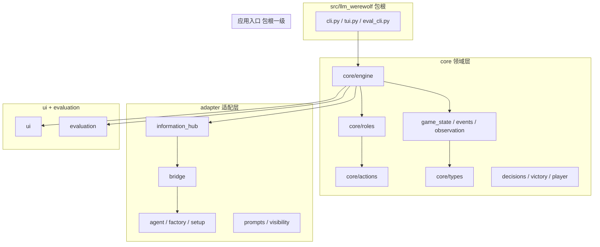

# MultiAgent-Werewolf 项目文件架构

> 版本：2026-05-20
> 说明：**当前已有** + **治理目标下建议新增** 的目录与存放规则。
> 职责边界见 [project-governance.md](./project-governance.md)。

---

## 1. 仓库顶层（放什么、不放什么）

```
MultiAgent-Werewolf/
├── src/llm_werewolf/     # 唯一 Python 包源码（可安装、可 import）
├── tests/                # 测试，目录镜像 src 分层
├── configs/              # 对局 YAML（人数、角色、模型），无业务逻辑
├── docs/                 # 设计/治理文档，不参与 import
├── scripts/              # 运维脚本（本地标记、工具），非运行时核心
├── runs/                 # 真局日志输出（gitignore），运行时生成
├── eval_runs/            # 评测产物（gitignore 或按需提交）
├── .env.example          # 环境变量模板，不含密钥
├── pyproject.toml        # 依赖、入口命令、pytest
└── README*.md            # 使用说明
```

| 路径                  | 存放规则                                    |
| --------------------- | ------------------------------------------- |
| `src/`                | 所有可发布代码；禁止放密钥、对局日志        |
| `configs/`            | 仅 YAML/JSON 配置；一条文件对应一种预设对局 |
| `docs/`               | Markdown 架构/流程/治理；与代码同步更新     |
| `runs/`、`eval_runs/` | 只写不入库（或仅样例）；程序输出目录        |
| `.venv/`              | 本地虚拟环境，不入库                        |

---

## 2. 预期包内架构图（分层）



**依赖方向（强制）**

```
应用入口 → core/engine → core/{game_state, roles, actions, events, observation}
                      ↘ adapter/{information_hub → bridge → agent}
应用入口、engine 不得 import ui（ui 可 import engine）
roles、actions 不得 import adapter（目标态；roles 经 `GameState.phase_interaction` 门面，不直接 import Hub）
adapter 不得 import engine 具体 Mixin（可 import core.types、decisions）
```

---

## 3. 完整目录树（当前 + 目标）

图例：`[已有]` · `[规划]` 治理文档建议后续新增

```
MultiAgent-Werewolf/
│
├── configs/                                    # 对局配置（应用层输入）
│   ├── demo.yaml                    [已有]
│   ├── example.yaml                 [已有]
│   ├── llm-6p-openai.yaml           [已有]
│   ├── llm-12p-agentscope.yaml      [已有]
│   └── …
│
├── docs/                                       # 文档（非代码）
│   ├── README.md                    [已有] 文档索引
│   ├── project-governance.md        [已有] 职责 + Event 可见性表
│   ├── project-master-plan.md       [已有] 重构阶段与 DoD
│   ├── project-structure.md         [已有] 本文件
│   ├── arch.md                      [已有] 架构概览
│   ├── architecture-improvement.md  [已有] 历史迁移（只读）
│   ├── workflow.md / roadmap.md
│   ├── adr/
│   └── LOCAL_ONLY-serial-agent-calls.md
│
├── scripts/                                    # 一次性/本地脚本
│   ├── mark-serial-local-only.sh    [已有]
│   └── unmark-serial-local-only.sh  [已有]
│
├── runs/                                       # 真 API 对局日志（输出）
│   └── *.log
│
├── eval_runs/                                  # 评测输出
│   └── <run_id>/{events.jsonl, report.md, …}
│
├── tests/                                      # 测试根 = testpaths
│   ├── adapter/                    镜像 adapter/
│   ├── core/                       镜像 core/
│   ├── config/
│   ├── evaluation/
│   └── integration/
│
└── src/llm_werewolf/                           # 主包
    │
    ├── __init__.py                  [已有]
    │
    │── ── 应用入口（包根，薄） ─────────────────────────
    ├── cli.py                       [已有] 控制台自动对局
    ├── tui.py                       [已有] Textual UI
    └── eval_cli.py                  [已有] 离线评测 CLI
    │
    │── ── agents/ + integration/ ─────────────────────
    ├── agents/
    │   ├── base.py                  [已有] create_agent、Demo/LLM/Human
    │   └── mixin.py                 [已有] PromptAgentMixin
    ├── integration/
    │   ├── agentscope.py            [已有] AgentScope 主实现
    │   └── message.py               [已有]
    │
    │── ── core/ 领域层 ───────────────────────────────
    ├── core/
    │   ├── __init__.py
    │   │
    │   ├── engine/                  # 阶段编排（Mixin），不解析 LLM
    │   │   ├── game_engine.py       [已有] 空组合类
    │   │   ├── base.py              [已有] 主循环、setup、观察、事件
    │   │   ├── night_phase.py       [已有] 夜：狼谈、技能、结算
    │   │   ├── day_phase.py         [已有] 白天讨论
    │   │   ├── voting_phase.py      [已有] 投票放逐
    │   │   ├── sheriff_election.py  [已有] 警长竞选
    │   │   ├── action_processor.py  [已有] 动作优先级与事件
    │   │   └── death_handler.py     [已有] 死亡、猎人、警徽
    │   │
    │   ├── game_state.py            [已有] 回合、阶段、票型、刀口
    │   ├── events.py                [已有] EventLogger
    │   ├── event_formatter.py       [已有] 事件 → 可读字符串
    │   ├── observation.py           [已有] 玩家观察视图
    │   ├── player.py                [已有] Player 实体
│   ├── victory.py               [已有] 胜负
│   ├── locale.py                [已有] 文案 i18n
    │   ├── utils.py                 [已有] 加载 YAML 等
    │   ├── serialization.py         [已有] 存档
    │   ├── role_registry.py         [已有] 兼容 → roles/registry.py
    │   ├── agent.py                 [已有] 兼容 → agents/base.py
    │   ├── prompts/                 [已有] PromptManager、selector、identity
    │   ├── phase_interaction.py     [已有] 引擎/角色 Agent 交互门面
    │   ├── event_visibility.py      [已有] Event.visible_to 默认规则
    │   ├── night_scheduler.py       [已有] 夜间技能顺序调度
    │   ├── role_night_plans.py      [已有] 核心角色夜间 LLM 规划
    │   ├── action_registry.py       [已有] Action 优先级表
    │   ├── death_abilities.py       [已有] 死亡技能角色表
    │   ├── decisions.py             [已有] SeatChoice/Speech/YesNo/Belief
    │   │
    │   ├── types/                   # 协议与 DTO，无业务逻辑
    │   │   ├── enums.py             GamePhase、EventType、Camp…
    │   │   ├── models.py            Event、PlayerInfo、GameStateInfo
    │   │   └── protocols.py         AgentProtocol、RoleProtocol…
    │   │
    │   ├── config/                  # 代码侧配置模型（非 YAML 文件）
    │   │   ├── game_config.py
    │   │   ├── player_config.py
    │   │   └── presets.py
    │   │
    │   ├── roles/                   # 角色规则：产 Action，不调 LLM（目标）
    │   │   ├── base.py
    │   │   ├── catalog.py / definition.py / registry.py
    │   │   ├── werewolf.py
    │   │   ├── villager.py
    │   │   └── neutral.py
    │   │
    │   └── actions/                 # 动作执行：改状态 + 返回消息
    │       ├── base.py
    │       ├── werewolf.py
    │       ├── villager.py
    │       └── common.py
    │
    │── ── adapter/ 适配层 ─────────────────────────────
    ├── adapter/
    │   ├── __init__.py              对外导出 Hub、Bridge、Agent
    │   ├── information_hub.py       [已有] MsgHub、通道、唯一 Agent I/O
    │   ├── bridge.py                [已有] Prompt + 解析 + 调 Agent
    │   ├── visibility.py            [已有] VisibilityChannel、RoutedMessage
    │   ├── agent.py                 [已有] 兼容 → integration/agentscope.py
    │   ├── factory.py               [已有] create_react_agent
    │   ├── setup.py                 [已有] bind_agentscope_roles
    │   ├── prompts.py               [已有] RolePrompts、GamePrompts
    │   ├── serial_calls.py          [已有] 全局限流（本地）
    │   └── message.py               [已有] 目标：删除或并入 Hub
    │
    │── ── ui/ 展示层 ─────────────────────────────────
    ├── ui/
    │   ├── console_presenter.py     [已有] CLI 事件渲染
    │   ├── tui_app.py               [已有]
    │   ├── styles.py
    │   └── components/
    │       ├── chat_panel.py
    │       ├── game_panel.py
    │       └── player_panel.py
    │
    └── evaluation/                  # 离线评测（可无 API）
        ├── runner.py
        ├── checkers.py
        ├── scenarios.py
        ├── recorder.py
        ├── reporter.py
        ├── models.py
        └── metrics.py
```

---

## 4. 分层存放规则（新建文件放哪）

| 你要加的东西                 | 放在                                                       | 命名建议                  |
| ---------------------------- | ---------------------------------------------------------- | ------------------------- |
| 新游戏阶段（如「遗言阶段」） | `core/engine/<phase>_phase.py` + 在 `game_engine.py` 继承  | `xxx_phase.py`            |
| 阶段状态字段                 | `core/game_state.py`                                       | 与 `GamePhase` 同步       |
| 新角色技能逻辑               | `core/roles/<camp>.py` 或新文件                            | 类名 = 角色英文名         |
| 新动作类型                   | `core/actions/*.py` + `types/enums.ActionType`             | `XxxAction`               |
| 新事件类型                   | `types/enums.EventType` + 在 `event_visibility` 登记可见性 | 见治理表                  |
| LLM 输出新格式               | `core/decisions.py` + `adapter/bridge.py`                  | `XxxDecision`             |
| MsgHub 新通道/路由           | `adapter/visibility.py` + `information_hub.py`             | 扩展 `VisibilityChannel`  |
| Catalog 提示词               | `core/prompts/`                                            | `implementation` 字段     |
| AgentScope 提示词            | `adapter/prompts.py`                                       | 与 factory 配合           |
| AgentScope 绑定              | `adapter/factory.py`、`setup.py`                           | —                         |
| 控制台/TUI 展示              | `ui/`                                                      | 只读 Event，不改状态      |
| 评测规则                     | `evaluation/checkers.py`                                   | 一个 Checker 一类         |
| 6/12 人预设                  | `configs/*.yaml`                                           | `llm-<n>p-<backend>.yaml` |
| 架构/流程文档                | `docs/*.md`                                                | 与 PR 同步                |

---

## 5. 模块 ↔ 路径速查

| 治理层             | 路径                                                          |
| ------------------ | ------------------------------------------------------------- |
| 应用入口           | `cli.py`, `tui.py`, `eval_cli.py`                             |
| 阶段控制           | `core/engine/*.py`, `core/game_state.py`                      |
| 规则状态           | `core/game_state.py`                                          |
| 事件与可见性       | `core/events.py`, `core/types/models.py`                      |
| 观察/Prompt 上下文 | `core/observation.py`, `engine/base.build_player_observation` |
| 角色规则           | `core/roles/`                                                 |
| 动作执行           | `core/actions/`                                               |
| 信息隔离 / MsgHub  | `adapter/information_hub.py`, `adapter/visibility.py`         |
| LLM 解析（Bridge） | `adapter/bridge.py`                                           |
| 决策契约类型       | `core/decisions.py`                                           |
| Agent 实现         | `agents/base.py`, `integration/agentscope.py`                 |
| 角色目录           | `core/roles/catalog.py`, `registry.py`                        |
| 展示               | `ui/`                                                         |
| 评测               | `evaluation/`                                                 |

---

## 6. 入口命令与文件关系

| 命令（pyproject 入口）      | 调用链                                 |
| --------------------------- | -------------------------------------- |
| `llm-werewolf` / `werewolf` | `cli.py` → `GameEngine` → configs      |
| `llm-werewolf-tui`          | `tui.py` → `TUIApp` → `GameEngine`     |
| `werewolf-eval`             | `eval_cli.py` → `evaluation/runner.py` |

配置文件路径由 CLI 参数传入，默认读 `configs/` 下 YAML。

---

## 7. 与父仓库 `werewolf/` 的关系

```
werewolf/                          # 工作区根（可能含多子项目）
├── 思路梳理.MD                    # 产品/研究思路（非运行时）
├── MultiAgent-Werewolf/           # 本仓库（本文档所在）
│   └── src/llm_werewolf/ …
└── …
```

运行时以 **`MultiAgent-Werewolf`** 为 Python 项目根；`werewolf/思路梳理.MD` 不 import。

---

## 8. 修订记录

| 日期       | 说明                                       |
| ---------- | ------------------------------------------ |
| 2026-05-20 | 首版：顶层规则、包内树、分层依赖、存放规则 |
