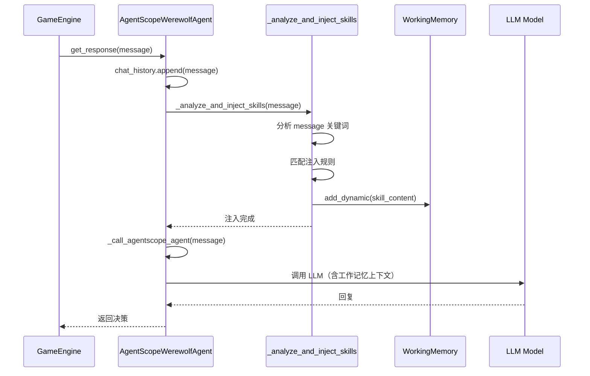

# Agent 决策时动态技能注入设计

> **状态**：proposed
> **最后更新**：2026-06-04
> **关联代码**：`src/llm_werewolf/agent_team/agents/agentscope_agent.py`
> **关联模块**：`agent_team/memory/`

## 1. 目标

在 Agent 每次做决策（发言/投票/夜晚行动）前，**自动分析当前局势**，动态注入相关的技能经验到工作记忆，使 Agent 能根据实时局势调整策略。

## 2. 核心思路

```
决策前 Prompt 到达
    ↓
分析 Prompt 关键词 + 局势特征
    ↓
匹配技能注入规则
    ↓
注入到 WorkingMemory (add_dynamic / add_persistent)
    ↓
get_context_for_decision() 组装最终 prompt
    ↓
LLM 决策
```

## 3. 实现方案

### 3.1 注入入口

在 [agentscope_agent.py](file:///Users/baimo/Desktop/werewolf/MultiAgent-Werewolf/src/llm_werewolf/agent_team/agents/agentscope_agent.py) 的 `get_response` 方法中插入分析钩子：

```python
async def get_response(self, message: str) -> str:
    self.chat_history.append({"role": "user", "content": message})

    if self.agentscope_agent is None:
        msg = f"AgentScope backend not initialized for player {self.name}"
        raise RuntimeError(msg)

    # ← 新增：决策前分析并注入技能经验
    await self._analyze_and_inject_skills(message)

    return await self._call_agentscope_agent(message)
```

### 3.2 分析器实现

#### 方案 A：规则式分析（推荐，零 LLM 调用）

```python
async def _analyze_and_inject_skills(self, message: str) -> None:
    """根据决策 prompt 内容，动态注入相关技能经验。"""
    memory_manager = getattr(self, "memory_manager", None)
    if memory_manager is None:
        return

    current_round = getattr(memory_manager.working, "current_round", 0)
    injected = False

    # 规则 1：投票阶段 → 注入投票策略
    if self._is_vote_phase(message):
        memory_manager.working.add_dynamic(
            content="[技能] 投票时优先跟随票数最多的玩家，避免分票。"
                    "若需改票，必须在顶层 reason 说明理由。",
            tag="skill_vote",
            round_number=current_round,
            priority=3,
        )
        injected = True

    # 规则 2：发言阶段 → 注入发言策略
    if self._is_speech_phase(message):
        if self.is_wolf:
            memory_manager.working.add_dynamic(
                content="[技能] 狼人发言：用公开信息构建怀疑链，"
                        "避免引用夜间私密信息。给出单一归票目标。",
                tag="skill_wolf_speech",
                round_number=current_round,
                priority=2,
            )
        else:
            memory_manager.working.add_dynamic(
                content="[技能] 好人发言：关注发言前后矛盾、投票与站边不一致。"
                        "用逻辑链而非直觉怀疑。",
                tag="skill_good_speech",
                round_number=current_round,
                priority=2,
            )
        injected = True

    # 规则 3：夜晚行动 → 注入夜晚策略
    if self._is_night_phase(message):
        if self.role == "prophet":
            memory_manager.working.add_dynamic(
                content="[技能] 预言家验人：优先验发言矛盾位或归票焦点位。",
                tag="skill_prophet_night",
                round_number=current_round,
                priority=3,
            )
        elif self.role == "witch":
            memory_manager.working.add_dynamic(
                content="[技能] 女巫救人：首夜必救，后续谨慎使用毒药。",
                tag="skill_witch_night",
                round_number=current_round,
                priority=3,
            )
        elif self.is_wolf:
            memory_manager.working.add_dynamic(
                content="[技能] 狼人夜间：优先刀神职位，避免刀明好人。",
                tag="skill_wolf_night",
                round_number=current_round,
                priority=3,
            )
        injected = True

    if injected:
        logger.debug(
            "skill_injection agent=%s round=%s role=%s",
            self.name, current_round, self.role,
        )
```

#### 规则判断辅助方法

```python
@staticmethod
def _is_vote_phase(message: str) -> bool:
    """判断是否为投票阶段。"""
    vote_keywords = ["投票", "vote", "put", "票型", "归票", "出"]
    return any(kw in message for kw in vote_keywords)

@staticmethod
def _is_speech_phase(message: str) -> bool:
    """判断是否为发言阶段。"""
    speech_keywords = ["发言", "speech", "演说", "讨论", "discussion"]
    return any(kw in message for kw in speech_keywords)

@staticmethod
def _is_night_phase(message: str) -> bool:
    """判断是否为夜晚阶段。"""
    night_keywords = ["夜晚", "night", "行动", "action", "验人", "救人", "刀"]
    return any(kw in message for kw in night_keywords)
```

#### 方案 B：LLM 辅助分析（更智能，但有额外调用）

```python
async def _analyze_and_inject_skills_llm(self, message: str) -> None:
    """使用 LLM 分析当前局势，注入相关技能经验。"""
    memory_manager = getattr(self, "memory_manager", None)
    if memory_manager is None:
        return

    prompt = (
        f"当前角色：{self.role}，座位：{self.number}\n"
        f"决策 prompt 摘要：{message[:500]}\n\n"
        "请判断当前局势最需要哪条技能经验，从以下选择：\n"
        "1. 投票策略：跟随票型，避免分票\n"
        "2. 发言策略：用公开信息构建怀疑链\n"
        "3. 夜晚策略：优先刀神职/验焦点位\n"
        "4. 说服策略：给出单一归票目标\n\n"
        "只回复编号，例如 1。"
    )

    try:
        compressor = getattr(memory_manager, "_llm_compressor", None)
        if compressor is None:
            return
        response = await compressor.call_llm_text(prompt, max_tokens=10)
        choice = response.strip()

        skill_map = {
            "1": ("[技能] 投票时优先跟随票数最多的玩家，避免分票。", "skill_vote"),
            "2": ("[技能] 用公开信息构建怀疑链，避免引用夜间私密信息。", "skill_speech"),
            "3": ("[技能] 夜晚行动优先针对神职位或焦点位。", "skill_night"),
            "4": ("[技能] 给出单一归票目标与清晰理由，避免多目标分散。", "skill_persuasion"),
        }

        if choice in skill_map:
            content, tag = skill_map[choice]
            memory_manager.working.add_dynamic(
                content=content,
                tag=tag,
                round_number=memory_manager.working.current_round,
                priority=2,
            )
    except Exception:
        logger.debug("LLM skill analysis failed, skipping", exc_info=True)
```

### 3.3 去重机制

避免同一轮次重复注入相同技能：

```python
def __init__(self, ...):
    ...
    self._injected_skills_this_round: set[str] = set()

async def _analyze_and_inject_skills(self, message: str) -> None:
    memory_manager = getattr(self, "memory_manager", None)
    if memory_manager is None:
        return

    current_round = memory_manager.working.current_round

    # 轮次变化时清空已注入记录
    if not hasattr(self, "_last_round") or self._last_round != current_round:
        self._injected_skills_this_round.clear()
        self._last_round = current_round

    # 检查是否已注入
    skill_key = f"{current_round}:{self._detect_phase_type(message)}"
    if skill_key in self._injected_skills_this_round:
        return

    # 注入技能
    ...
    self._injected_skills_this_round.add(skill_key)

def _detect_phase_type(self, message: str) -> str:
    if self._is_vote_phase(message):
        return "vote"
    if self._is_speech_phase(message):
        return "speech"
    if self._is_night_phase(message):
        return "night"
    return "unknown"
```

## 4. 注入效果

### 4.1 注入到 prompt 的位置

技能经验注入到 WorkingMemory 后，会在 `get_context_for_decision()` 中组装：

```
【本局固定信息】
- 角色池：Werewolf x2, Villager x3, Prophet x1, Witch x1, Guard x1

【内心信念】
- 我认为 3 号是狼人（基于发言矛盾）

【稳定经验】
- [程序记忆] 我的策略：积极归票

【历史回顾】
- 第1轮：做了2个决策，听到3段发言

【本轮记忆】          ← 动态注入的技能出现在这里
- 3号发言：我认为5号可疑...
- 5号发言：我才是预言家...
- [技能] 投票时优先跟随票数最多的玩家，避免分票...
```

### 4.2 注入时机流程图



## 5. 配置控制

### 5.1 MemoryConfig 扩展

在 [config.py](file:///Users/baimo/Desktop/werewolf/MultiAgent-Werewolf/src/llm_werewolf/agent_team/memory/config.py) 中添加开关：

```python
class MemoryConfig(BaseModel):
    ...
    enable_dynamic_skill_injection: bool = Field(
        default=True,
        description="在决策前动态分析局势并注入技能经验",
    )
    dynamic_skill_injection_mode: str = Field(
        default="rule_based",  # "rule_based" | "llm_assisted" | "disabled"
        description="动态技能注入模式",
    )
```

### 5.2 使用方式

```yaml
# configs/memory_dynamic_skills.yaml
memory:
  enable_dynamic_skill_injection: true
  dynamic_skill_injection_mode: "rule_based"  # 零 LLM 调用
  # 或 "llm_assisted"  # 使用 LLM 分析局势（有额外调用）
```

## 6. 性能影响

| 模式 | LLM 调用 | 延迟影响 | 效果 |
|------|----------|----------|------|
| `rule_based` | 0 次 | 可忽略（纯字符串匹配） | 中 |
| `llm_assisted` | 1 次/决策 | 增加 1-3s | 高 |
| `disabled` | 0 次 | 无 | 无 |

**推荐比赛用 `rule_based`**，零额外调用，效果足够。

## 7. 测试要点

### 7.1 单元测试

```python
@pytest.mark.asyncio
async def test_skill_injection_on_vote_phase():
    agent = create_test_agent(role="villager")
    message = "请投票，选择你要放逐的玩家"

    await agent.get_response(message)

    # 验证工作记忆中有注入的技能
    context = agent.memory_manager.working.get_context()
    assert "[技能]" in context
    assert "投票" in context

@pytest.mark.asyncio
async def test_no_duplicate_injection_same_round():
    agent = create_test_agent(role="villager")
    message = "请投票"

    await agent.get_response(message)
    await agent.get_response(message)  # 第二次不应重复注入

    context = agent.memory_manager.working.get_context()
    # 验证技能只出现一次
    assert context.count("[技能]") == 1
```

### 7.2 集成测试

```python
@pytest.mark.asyncio
async def test_full_game_skill_injection():
    config = create_game_config_from_player_count(6)
    config.memory.enable_dynamic_skill_injection = True

    engine = GameEngine(config)
    # 跑完整局游戏
    await engine.run()

    # 验证每个 agent 的工作记忆都有技能注入
    for player in engine.game_state.players:
        if player.agent and player.agent.memory_manager:
            context = player.agent.memory_manager.working.get_context()
            assert "[技能]" in context or len(context) > 0
```

## 8. 后续演进

| 阶段 | 内容 |
|------|------|
| Phase 1 | 规则式注入（本文档） |
| Phase 2 | LLM 辅助分析（可选） |
| Phase 3 | 配置化注入规则（YAML 定义） |
| Phase 4 | 赛后技能权重反馈闭环 |

## 9. 风险与缓解

| 风险 | 影响 | 缓解 |
|------|------|------|
| 重复注入 | prompt 膨胀 | 去重机制（`_injected_skills_this_round`） |
| 规则不匹配 | 技能不注入 | 规则覆盖主要阶段 + fallback |
| LLM 模式超时 | 延迟增加 | 超时跳过，不影响主流程 |
| 技能冲突 | Agent 困惑 | priority 机制，高优先级覆盖 |

## 10. 代码变更清单

| 文件 | 变更 |
|------|------|
| `agent_team/agents/agentscope_agent.py` | 添加 `_analyze_and_inject_skills` 方法 |
| `agent_team/memory/config.py` | 添加 `enable_dynamic_skill_injection` 配置项 |
| `agent_team/memory/working_memory.py` | 无需变更（已有 `add_dynamic`） |
| `tests/agent_team/test_skill_injection.py` | 新增测试文件 |
