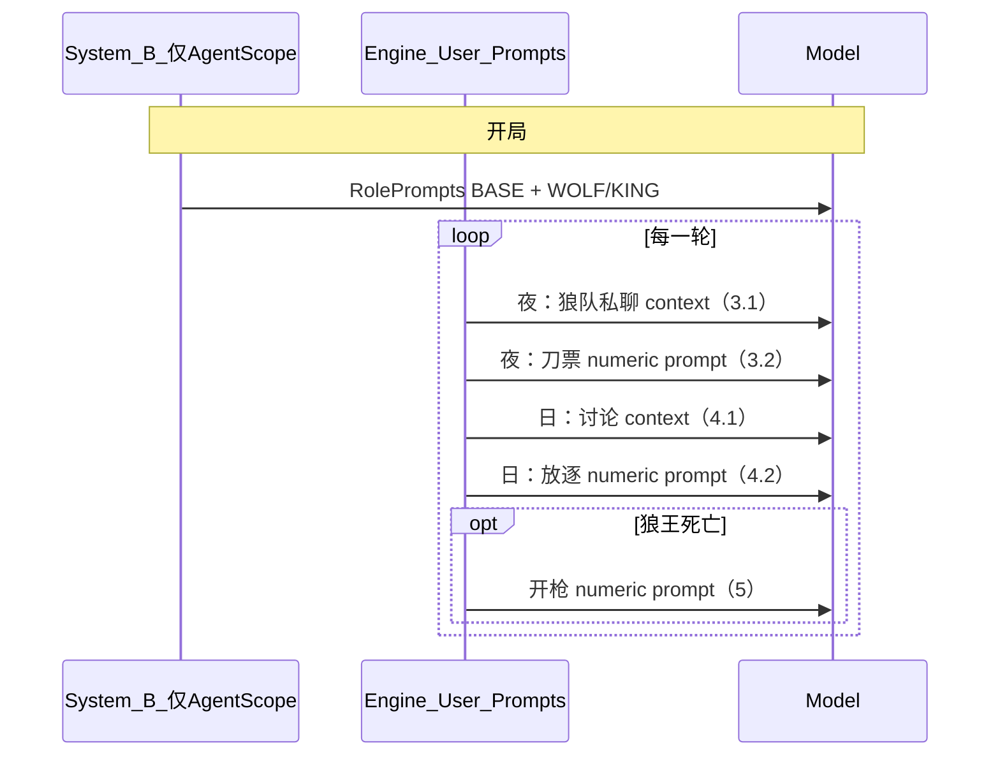

# 狼人玩家：各阶段实际提示词说明

本文档描述 **当前代码库**（`main` / `cursor/prompt-v2-json-output-ee2f`）中，**狼人阵营玩家**在真实对局里会收到的提示词来源与完整结构。
标准 12 人局常见角色：`Werewolf`（普通狼）、`AlphaWolf`（狼王，引擎内英文名；适配层中文为「狼王」）。

---

## 1. 两条调用链（必读）

| 链路                   | 何时生效                                                              | 系统人设                                                                                                             | 各阶段 user 提示                                                           |
| ---------------------- | --------------------------------------------------------------------- | -------------------------------------------------------------------------------------------------------------------- | -------------------------------------------------------------------------- |
| **A. 引擎直连**        | `cli.py` 默认：`create_agent(..., use_agentscope=False)` → `LLMAgent` | **无** 固定 system；每次 `get_response` 仅发本轮英文上下文 + `Please respond in {language}.`                         | `core/engine/*`、`core/action_selector.py`、`core/roles/werewolf.py`       |
| **B. AgentScope 适配** | `create_agent(..., use_agentscope=True)` → `AgentScopeWerewolfAgent`  | **有**：`adapter/prompts.py` 的 `RolePrompts.BASE_PROMPT` + `WOLF` / `WOLF_KING` 卡（写入 `chat_history` 的 system） | 同上引擎 user 提示仍会追加；若 API 失败则走 `adapter/agent.py` 的 fallback |

**重要：** `adapter/prompts.py` 里的 `GamePrompts`（如 `WOLF_OPEN`、`SPEECH_PROMPT`）**目前未被引擎 import 或调用**，仅作预留文案。实际刀人/发言/投票走的是引擎英文模板。

**重要：** `setup_game` 分配的是引擎角色（`Werewolf` / `AlphaWolf`），**不会**自动把 `AgentScopeWerewolfAgent.role` 设为 `wolf`；若未手动同步，适配层 system 可能仍是默认「村民」。12 人 DeepSeek 实验若接了 AgentScope ReAct，需确认工厂是否写入 `role`/`number`。

---

## 2. 全程固定：适配层 System（仅链路 B）

**文件：** `src/llm_werewolf/adapter/prompts.py` → `RolePrompts.BASE_PROMPT` + `RolePrompts.WOLF` 或 `WOLF_KING`
**组装：** `src/llm_werewolf/adapter/agent.py` → `_init_system_prompt()`

### 2.1 公共底座 `BASE_PROMPT`（占位符已展开）

```
你是一个狼人杀玩家，你将参与一场狼人杀对局，想尽一切办法获胜
我们标准配置有12名玩家：四名村民，一名预言家，一名女巫，三个狼人，一个狼王，一个守卫，一个猎人
总共有12位玩家，请使用玩家编号互相称呼
编号和角色的对应顺序将会打乱，不按照任何规律
你的编号是：{number}
你的身份是：{role_name}
{role_instruction}
建议：{suggestion}
你的计划：{plan}
你应当每回合输出分析，放在两个大括号{{}}中，这里面的内容只会被你自己阅读
你的最终的结果（玩家代号或者选择或药水选择或遗言或收到），尤其注意白天发言，以上内容务必放在[[]]像这样的两个中括号中
例如
[[1]]
确保它没有任何其他内容
在无需目标的情况下，例如遗言，讨论，你不能输出这个内容
你的语言应该不那么专业，保持普通人的能力即可，但是尽量积极发言，可以大胆一点
```

### 2.2 普通狼 `WOLF`

| 字段               | 内容                                                                                                                                                                     |
| ------------------ | ------------------------------------------------------------------------------------------------------------------------------------------------------------------------ |
| `role_name`        | 狼人                                                                                                                                                                     |
| `role_instruction` | 你与另一名狼人和一名狼王协同作战，夜间选择击杀目标，白天需要隐藏身份                                                                                                     |
| `suggestion`       | 第一夜建议随机选择或自刀和刀队友。发言阶段可以伪装成预言家来骗玩家，尽量配合队友欺骗平民票出神职，也建议自刀来骗女巫和平民。别忘了发言顺序，不要乱说没发言的玩家发言很怪 |

`{plan}` 来自配置/策略，默认「自由发挥」（见 `PlanStrategies`）。

### 2.3 狼王 `WOLF_KING`

| 字段               | 内容                                                                                                                                                                                             |
| ------------------ | ------------------------------------------------------------------------------------------------------------------------------------------------------------------------------------------------ |
| `role_name`        | 狼王                                                                                                                                                                                             |
| `role_instruction` | 你与三名狼人协同作战，夜间选择击杀目标，白天需要隐藏身份。当你在白天被票出局或在夜晚被女巫毒死时，你可以发动技能带走一名玩家，但不会公布你的身份。其他玩家只知道是猎人或狼王中的一个发动了技能。 |
| `suggestion`       | 与普通狼相同的长策略句                                                                                                                                                                           |

---

## 3. 夜晚阶段

### 3.1 狼队私聊（仅当存活狼人 ≥ 2）

**文件：** `src/llm_werewolf/core/engine/night_phase.py` → `_run_werewolf_discussion`
**调用：** `werewolf.agent.get_response(context)`（自由文本，非 `ActionSelector`）

**每条狼人依次收到的 user 消息结构：**

```
{build_shared_observation 输出}
You are {玩家名}, a Werewolf.
Current: Round {N} - Night Phase
You are working with these werewolves: {队友名列表}.
Available targets: {可刀的非狼玩家名列表}.

[Werewolf team discussion:]
{队友名}: {发言}
...（历史私聊）

Discuss with your fellow werewolves who should be eliminated tonight.
Share your thoughts and suggestions (1-2 sentences).
```

其中 `build_shared_observation` 由 `core/observation.py` 格式化，典型包含：

```
You are {name}.
Current phase: night
Current round: {N}
Alive summary: {alive}/{total} alive, werewolves alive: {w}, villagers alive: {v}

Visible players:
- {name} ({id}): alive|dead
...

Visible event history:
- [night R{N}] {事件文案}
...

Private notes:
- You are coordinating with these werewolves: ...
- Available targets: ...
```

（私聊频道里还会带上同阵营可见事件；具体事件集由 `event_logger.get_events_for_players` 决定。）

**API 失败时 fallback（已修复）：** `adapter/agent.py` → 狼队协调短句，**禁止**「我是好人」「我是狼人」等身份句。

---

### 3.2 狼人刀人投票（每个存活狼人各投一票）

**文件：** `src/llm_werewolf/core/roles/werewolf.py`（`AlphaWolf` 等同理，仅 `role_name` 不同）
**调用：** `ActionSelector.get_target_from_agent` → `agent.get_response(prompt)`

**附加上下文 `additional_context`（在标准 prompt 之前拼接进 `Available targets` 段上方）：**

```
{agent.get_decision_context() 可选：Your previous actions: ...}

Your living werewolf teammates: {队友名}.   # 见 Werewolf.get_private_notes

You are working with these werewolves: {队友名列表}.
All werewolves will vote on who to eliminate tonight.
Choose a villager to vote for as {Werewolf|Alpha Wolf|...}.
```

**标准选目标 prompt（`action_selector.build_target_selection_prompt`）：**

```
You are a {Werewolf|Alpha Wolf}.
Current: Round {N} - Night
Action: Vote for a player to kill tonight

{additional_context 见上}

Available targets:
1. {名字} (Player ID: player_x)
2. ...

Please select a target by responding with ONLY the number (1, 2, 3, etc.).
Do not include any other text in your response.
```

**观测里的 Private notes（`build_player_observation` 时也会给狼人）：**

```
- Your role is Werewolf.
- You are a Werewolf. Each night, you wake up with other werewolves ...
- Your living werewolf teammates: ...
```

狼王为 `Your role is Alpha Wolf.` + 对应 `description`。

**解析：** 取响应中第一个数字，映射到 `Available targets` 列表下标。失败且 `fallback_random=True` 时随机目标。

**未使用的预留中文（GamePrompts）：** `WOLF_OPEN`、`WOLF_TEAMMATES`、`WOLF_RECHOOSE` — 当前引擎 **不发送**。

---

### 3.3 扩展狼角色（若板子包含）

在 3.2 的刀票之外，同一夜晚可能再收到额外 `get_target_from_agent`（英文），例如：

| 角色           | 额外 Action 行                       | additional_context 要点     |
| -------------- | ------------------------------------ | --------------------------- |
| White Wolf     | Choose a werewolf to kill (or skip)  | 可选杀狼；`allow_skip=True` |
| Wolf Beauty    | Choose a player to charm             | 死亡带走魅惑目标等          |
| Guardian Wolf  | Choose a werewolf to protect tonight | 保护一名狼                  |
| Nightmare Wolf | Choose a player to block tonight     | 封锁技能                    |

均复用 §3.2 的 `build_target_selection_prompt` 外壳。

---

## 4. 白天阶段

### 4.1 白天发言（所有存活玩家，含狼）

**文件：** `src/llm_werewolf/core/engine/day_phase.py` → `_build_discussion_context`

```
{build_player_observation：含 Visible events + Private notes}

{Your previous actions: ...  # 来自 agent.add_decision 的安全摘要}

Share your thoughts, suspicions, or information. Your goal is to help your team win while staying in character.

Provide a brief statement (1-3 sentences) for this discussion round.
```

**LLMAgent 追加：** `\nPlease respond in {language}.`

**未使用预留中文：** `GamePrompts.SPEECH_BEGIN` / `SPEECH_PROMPT`。

---

### 4.2 白天放逐投票

**文件：** `src/llm_werewolf/core/engine/voting_phase.py`

**`_build_voting_context`：**

```
{build_player_observation}

{Your previous actions: ...}

Based on the discussion and your role knowledge, vote for the player you believe should be eliminated.
```

**随后 `ActionSelector.get_target_from_agent`：**

```
You are a {Werewolf|Alpha Wolf|...}.
Current: Round {N} - Voting
Action: Vote for a player to eliminate

{上面的 voting context}

Available targets:
1. ...
Please select a target by responding with ONLY the number (1, 2, 3, etc.).
Do not include any other text in your response.
```

**未使用预留中文：** `GamePrompts.VOTE_BEGIN`（要求 `[[座位号]]` 格式）。

---

## 5. 死亡技能（狼王 / Alpha Wolf）

**文件：** `src/llm_werewolf/core/engine/death_handler.py` → `_process_hunter_or_alpha_death`
**触发：** 白天被票出或夜晚死亡等流程结束后，对 `Hunter` / `AlphaWolf` 且未被女巫毒死。

```
You are a Alpha Wolf.
Action: Choose a player to shoot before you die

You ({玩家名}) have been killed. You can take one player down with you.

Available targets:
1. {存活玩家} ...
Please select a target by responding with ONLY the number ...
```

**未使用预留中文：** `GamePrompts.WOLF_KING_DEATH`（`[[0]]` 表示不开枪）。

---

## 6. 其他可能触达狼人的阶段

| 阶段            | 是否狼人专属 | 提示来源                                                         |
| --------------- | ------------ | ---------------------------------------------------------------- |
| 警长竞选 / 发言 | 否           | `sheriff_election.py` + `ActionSelector`（英文 YES/NO 或选目标） |
| 猎人开枪        | 否（猎人）   | 同 death_handler 模板，`role_name` 为 Hunter                     |
| 胜负判定后      | —            | 无 LLM 提示                                                      |

---

## 7. 对局时间线（狼人视角）



---

## 8. 与日志现象的对应关系

| 现象                                 | 原因                                                                               |
| ------------------------------------ | ---------------------------------------------------------------------------------- |
| 狼队频道出现「我是好人」「我是狼人」 | 旧版 `_generate_fallback_response` 随机台词；已在 `adapter/agent.py` 按场景修复    |
| 模型看到中文 system、英文 user       | 链路 B + 引擎英文混用                                                              |
| 刀票讨论说 5 号、票型解析为 4 号     | `ActionSelector` 只认**列表序号** 1..n，不是座位号；与私聊里说的「几号」可能不一致 |
| `GamePrompts` 与实机不符             | 文案未接入引擎                                                                     |

---

## 9. 源码索引

| 内容                       | 路径                                            |
| -------------------------- | ----------------------------------------------- |
| 中文 system / 预留流程文案 | `src/llm_werewolf/adapter/prompts.py`           |
| Agent 封装与 fallback      | `src/llm_werewolf/adapter/agent.py`             |
| 夜聊                       | `src/llm_werewolf/core/engine/night_phase.py`   |
| 刀票逻辑                   | `src/llm_werewolf/core/roles/werewolf.py`       |
| 选目标/投票 prompt 模板    | `src/llm_werewolf/core/action_selector.py`      |
| 白天发言                   | `src/llm_werewolf/core/engine/day_phase.py`     |
| 白天投票                   | `src/llm_werewolf/core/engine/voting_phase.py`  |
| 狼王开枪                   | `src/llm_werewolf/core/engine/death_handler.py` |
| 观测格式化                 | `src/llm_werewolf/core/observation.py`          |

---

*文档生成对应当前仓库实现；若后续将 `GamePrompts` 或 `WerewolfAdapterBridge` 接入引擎，请同步更新本节。*
