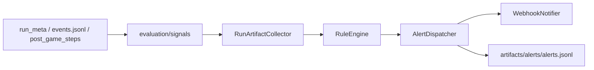

# Observability 设计

> **模块**：observability
> **状态**：active
> **最后更新**：2026-06-02
> **关联代码**：`src/llm_werewolf/observability/`
> **关联测试**：`tests/observability/`、`tests/evaluation/signals/`

---

## 1. 职责边界

| 组件 | 路径 | 职责 |
|------|------|------|
| models | `observability/models.py` | `AlertEvent`、`AlertSeverity`（对齐 `CheckSeverity`） |
| collectors | `observability/collectors/` | 从 run 产物归一化信号 |
| rules | `observability/rules/` | 8 项 Phase 1 阈值规则 |
| dispatcher | `observability/dispatcher.py` | 去重、审计写盘、Webhook 分发 |
| notifiers | `observability/notifiers/` | `WebhookNotifier` |
| health | `observability/health.py` | `/ready` 探测逻辑 |
| signals | `evaluation/signals/` | `scan_run_dir`、`load_post_game_signals`（可复用质量信号） |

**禁止**：`evaluation` / `game_runtime` / `agent_team` → `observability`（由架构测试锁定）。

## 2. 数据流

## 3. 进程内挂载（interface 薄层）

| 挂载点 | 行为 |
|--------|------|
| `finalize_run` | PostGame 结束后 `emit_from_post_game`，写 `run_meta.post_game_status` |
| `game_sessions` | 对局 crash → `emit_session_failed`；status 暴露 `post_game_status` |
| `GET /ready` | artifacts 可写、可选 ARK key |
| `werewolf-watch` | 批量扫描 `artifacts/runs/`、`eval_runs/` |

## 4. Phase 1 规则（8 项）

| code | 来源 | 默认阈值 |
|------|------|----------|
| `run_failed` | `run_meta.status=failed` | 启用 |
| `post_game_failed` | `post_game_steps` / pipeline error | 启用 |
| `error_events_per_run` | RuntimeErrorEventChecker 计数 | >3 warning |
| `checker_critical` | CRITICAL checker 失败 | 立即 critical |
| `llm_replay_failed` | `post_game_analysis.mode=failed` | warning |
| `vote_timeout_per_run` | ERROR 含 TimeoutError | >2 warning |
| `structured_invoke_gave_up` | ERROR/日志信号 | >10 warning |
| `provider_429_burst` | 429 / rate limit 信号 | ≥3 error |

配置：`configs/observability.yaml` 或环境变量 `OBS_ALERT_*`。

## 5. 产物约定

| 文件 | 说明 |
|------|------|
| `artifacts/alerts/alerts.jsonl` | 全局告警审计 |
| `artifacts/alerts/alerts.json` | watch 批处理摘要 |
| `<run_dir>/alert_report.json` | 单场告警报告 |
| `run_meta.json` 扩展 | `post_game_status`、`alert_count` |

## 6. 与基线报告的关系

[监控预警现状与不足分析](../reports/监控预警现状与不足分析.md) Phase 1 条目已在本模块落地：

1. `werewolf-watch` 替代建议的 `scripts/watch_runs.py`
2. `post_game_status` 写入 `run_meta.json`
3. `GET /ready` 增强就绪探测
4. Webhook 抽象 + 去重 dispatcher

Phase 2+（Prometheus、CI 门禁、飞书插件）见 [ROADMAP.md](./ROADMAP.md)。
