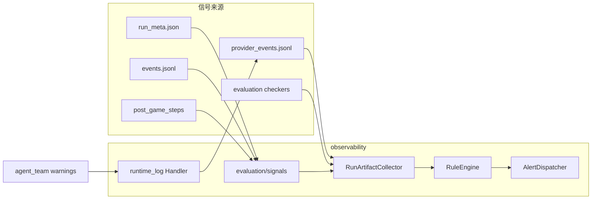

# Observability 设计

> **模块**：observability
> **状态**：active
> **最后更新**：2026-06-02
> **关联代码**：`src/llm_werewolf/observability/`
> **关联测试**：`tests/observability/`、`tests/evaluation/signals/`

---

## 1. 职责边界

| 组件 | 路径 | 职责 |
|------|------|------|
| models | `observability/models.py` | `AlertEvent`、`AlertSeverity`（对齐 `CheckSeverity`） |
| collectors | `observability/collectors/` | 从 run 产物归一化信号 |
| rules | `observability/rules/engine.py` | 9 项阈值规则 |
| dispatcher | `observability/dispatcher.py` | 去重、审计写盘、Webhook 分发 |
| notifiers | `observability/notifiers/` | `WebhookNotifier` |
| health | `observability/health.py` | `/ready` 探测逻辑 |
| runtime_log | `observability/runtime_log.py` | 对局内日志 → `provider_events.jsonl` |
| signals | `evaluation/signals/` | `scan_run_dir`、`load_post_game_signals` |

**禁止**：`evaluation` / `game_runtime` / `agent_team` → `observability`（架构测试锁定）。

**设计原则**：不在 `game_runtime` 发 Webhook；不在 `evaluation/post_game` pipeline 内硬编码 Notifier；`agent_team` 不 import `observability`——运行时信号通过 **logging handler** 采集。

## 2. 数据流

## 3. 进程内挂载（interface 薄层）

| 挂载点 | 文件 | 行为 |
|--------|------|------|
| 对局开始 | `interface/cli/entry.py`、`game_sessions._run_game` | `attach_run_log_handler(run_dir)` |
| 对局结束 | 同上 + `finally` | `detach_run_log_handler()` |
| PostGame 后 | `finalize_run.py` | `emit_from_post_game`；写 `post_game_status` / `alert_count` |
| API 会话失败 | `game_sessions.py` | `emit_session_failed`；`GET .../status` 暴露 `post_game_status` |
| HTTP | `api/app.py` | `GET /health`（liveness）、`GET /ready`（readiness） |
| CLI | `watch_cli.py` | `werewolf-watch` 扫 `artifacts/runs/`、`eval_runs/` |

`post_game_status`：`ok` | `failed` | `skipped`；`result.error` 或 `stage_errors` 非空时为 `failed`。

## 4. 运行时日志采集（`provider_events.jsonl`）

对局期间绑定 `RunObservabilityLogHandler` 到 `llm_werewolf` logger（WARNING+），匹配以下日志并追加 JSONL：

| kind | 匹配模式（示例） | 典型来源 |
|------|------------------|----------|
| `provider_429` | 含 `429`、`rate limit` | agentscope / eval_agent |
| `structured_invoke_gave_up` | 含 `structured_invoke_gave_up` | `structured_invoke.py` |
| `agent_fallback` | `using fallback`、`using random fallback`、`fallback seat=` | `bridge.py` 发言/投票降级；记忆压缩 fallback |

**局限**：未打 warning 的静默 fallback（如部分 agentscope 内部 `_generate_fallback_response` 路径）不会进入 JSONL；后续可在 `agent_team` 统一打点（Phase 2）。

## 5. 告警规则（9 项）

| code | 来源 | 默认阈值 |
|------|------|----------|
| `run_failed` | `run_meta.status=failed` | 启用即告警 |
| `post_game_failed` | `post_game_steps` failed / pipeline error | 启用即告警 |
| `error_events_per_run` | `events.jsonl` ERROR 计数 | >3 → warning |
| `checker_critical` | CRITICAL checker 失败 | 立即 critical |
| `llm_replay_failed` | `post_game_analysis.mode=failed` | warning |
| `vote_timeout_per_run` | ERROR 含 TimeoutError | >2 → warning |
| `structured_invoke_gave_up` | checker + `provider_events` | >10 → warning |
| `provider_429_burst` | checker + `provider_events` | ≥3 → error |
| `agent_fallback_per_run` | `provider_events` | >5 → warning |

配置：`configs/observability.yaml`；环境变量：

| 变量 | 说明 |
|------|------|
| `OBS_ALERT_WEBHOOK_URL` | Webhook 地址（YAML 中 `${OBS_ALERT_WEBHOOK_URL}` 会展开） |
| `OBS_ALERT_MIN_SEVERITY` | 最低推送级别（默认 `warning`） |
| `OBS_ALERT_DEDUPE_TTL` | 去重冷却秒数（默认 300） |
| `OBS_ALERTS_DIR` | 告警审计目录（默认 `artifacts/alerts`） |
| `OBS_READY_REQUIRE_ARK` | `0` 时 `/ready` 跳过 ARK key 检查 |

## 6. 产物约定

| 文件 | 说明 |
|------|------|
| `artifacts/alerts/alerts.jsonl` | 全局告警审计（append） |
| `artifacts/alerts/alerts.json` | `werewolf-watch` 批处理摘要 |
| `<run_dir>/alert_report.json` | 单场告警报告 |
| `<run_dir>/provider_events.jsonl` | 运行时 LLM/fallback 事件 |
| `run_meta.json` | 扩展 `post_game_status`、`alert_count` |

## 7. 与 evaluation 的协作

| 能力 | 位置 | 用途 |
|------|------|------|
| `scan_run_dir` | `evaluation/signals/run_scan.py` | 对已有 run 跑 checker 子集 + ERROR 事件 |
| `load_post_game_signals` | `evaluation/signals/post_game_signals.py` | 解析 PostGame 步级状态 |
| `derive_post_game_status` | 同上 | `finalize_run` 写入 `run_meta` |

evaluation **不包含** Notifier/Webhook，保持「质量审计」与「运维告警」分离。

## 8. 基线报告对照

[监控预警现状与不足分析](../reports/监控预警现状与不足分析.md) Phase 1 已落地：

1. `werewolf-watch` 批量扫 run 目录  
2. `post_game_status` / `alert_count` 写入 `run_meta.json`  
3. `GET /ready` 就绪探测  
4. Webhook + 去重 dispatcher  
5. 429 / structured_invoke / **agent fallback** 运行时采集  

Phase 2+ 见 [ROADMAP.md](./ROADMAP.md)（`run_quality.json`、`GET /metrics`、Feishu、CI 门禁）。
