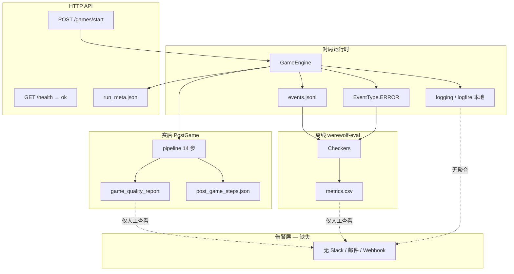

# 监控预警现状与不足分析

> **模块**：跨模块（interface / game_runtime / agent_team / evaluation）
> **状态**：active
> **最后更新**：2026-06-02
> **关联代码**：见下文「现状清单」
> **用途**：为后续「监控预警」建设提供基线评估与演进建议

---

## 1. 摘要

MultiAgent-Werewolf **尚无生产级线上监控**（无 Prometheus / Sentry / 飞书常驻推送 / Grafana）。**2026-06 起**已落地离线告警模块 `observability`（`werewolf-watch`、9 项规则、可选 Webhook），适合比赛跑局后的产物巡检。现有能力还包括：

1. **离线、产物驱动**的质量检查（`werewolf-eval` checkers、PostGame 14 步、`game_quality_report`）
2. **进程内日志**（stdlib `logging` + Logfire 本地模式，不上云）
3. **极简存活探针**（`GET /health` 固定返回 `ok`）
4. **CI 测试与安全扫描**（与运行时质量无直接联动）

对局失败、PostGame 流水线失败、Agent fallback 过多等问题，**可经 `werewolf-watch` 与 `alert_report.json` 自动发现**；未跑巡检时仍须人工翻产物。

**结论**：项目具备较完整的「赛后审计」能力，但缺少「运行中/运行后即时发现 + 主动告警 + 可聚合指标」三层能力。下文按层次盘点现状、指出不足，并给出分阶段建设建议。

---

## 2. 现状清单

### 2.1 运行时：事件与错误记录

| 能力 | 位置 | 行为 |
|------|------|------|
| 对局事件流 | `game_runtime/events/events.py` → `artifacts/runs/<id>/events.jsonl` | 全量事件持久化，含 `player_speech`、`vote_cast`、`role_acting` 等 |
| 运行时 ERROR 事件 | `game_runtime/engine/*_phase.py`、`action_processor.py`、`night_scheduler.py` | 投票超时、夜间行动失败等写入 `EventType.ERROR`（如 `[投票失败 - TimeoutError]`） |
| 会话元数据 | `interface/api/services/game_sessions.py` → `run_meta.json` | `status`（running / completed / failed / cancelled）、`error`、时间戳 |
| 增量写盘 | `IncrementalEventWriter` | 对局进行中追加 `events.jsonl`，便于中断后排查 |

**特点**：错误被**记录**而非**告警**；前端/CLI 可在控制台看到 ERROR 着色，但无集中汇聚。

### 2.2 HTTP API 健康与状态

| 端点 | 位置 | 行为 |
|------|------|------|
| `GET /health` | `interface/api/app.py` | 固定 `{"status": "ok"}`（liveness） |
| `GET /ready` | 同上 | artifacts 可写、可选 ARK key（readiness） |
| `GET /api/v1/games/{run_id}/status` | `interface/api/routes/actions.py` | 含 `post_game_status`、`alert_count` |
| `POST /api/v1/runs/{run_id}/post-game` | 同上 | 手动触发 PostGame；失败时返回 message，无告警 |

**PostGame 失败处理**（`game_sessions.py`）：对局引擎正常结束时，即使 PostGame 报错，会话仍标记为 `COMPLETED`，仅 `logger.warning("PostGame failed for %s: ...")`。调用方需主动查日志或产物才能发现复盘缺失。

### 2.3 日志与 trace

| 组件 | 位置 | 行为 |
|------|------|------|
| Logfire | `src/llm_werewolf/__init__.py` | `logfire.configure(send_to_logfire=False)`，**不上传云端** |
| 结构化决策 | `agent_team/invocation/structured_invoke.py` | 失败时 `logger.warning`（`structured_validate_failed`、`structured_invoke_gave_up` 等） |
| Agent 降级 | `agent_team/bridge.py`、`agentscope_agent.py` | 女巫/发言/投票 fallback 路径打 warning |
| 记忆压缩 | `agent_team/memory/llm_compressor.py` | 每 5 次失败打一次 periodic warning |
| 投票意向并行 | `agent_team/communication/information_hub.py` | 单玩家意向失败 warning，不中断整局 |
| CLI 对局 | `interface/cli/entry.py` | `logfire.error("game_execution_error")` |
| PostGame | `interface/cli/runtime/finalize_run.py` | PostGame / prompt evolution 失败 `logger.error` / `warning` |

**特点**：日志分散、无统一 JSON schema、无 `run_id` 关联 ID 规范、无日志聚合后端。

**PostGame 失败处理**（`game_sessions.py`）：对局引擎正常结束时，会话仍标记为 `COMPLETED`，但 `run_meta.post_game_status` 与 `GET .../status` 可区分复盘是否成功（2026-06 observability 落地）。

### 2.4 离线告警（observability，2026-06 新增）

| 组件 | 位置 | 行为 |
|------|------|------|
| 告警引擎 | `observability/` | 9 项规则、去重、`alert_report.json` |
| 批量巡检 | `werewolf-watch` | 扫 `artifacts/runs/`、`eval_runs/` |
| 运行时采集 | `observability/runtime_log.py` | 429 / structured_invoke / **agent fallback** → `provider_events.jsonl` |
| 信号层 | `evaluation/signals/` | checker 子集 + PostGame 信号 |

文档：[observability/DESIGN.md](../observability/DESIGN.md)

### 2.5 离线评测（werewolf-eval）

| 组件 | 位置 | 行为 |
|------|------|------|
| 批量 runner | `evaluation/core/runner.py` | 多局 DemoAgent/真实配置；捕获 crash / timeout |
| Checkers | `evaluation/core/checkers.py` | 见下表 |
| 单局产物 | `evaluation/core/recorder.py` | `checks.json`、`errors.jsonl`、`events.jsonl` |
| 聚合指标 | `evaluation/core/metrics.py` + `reporter.py` | `summary.json`、`metrics.csv`、`report.md` |

**Checker 与严重级别**（`CheckSeverity`：info / warning / error / critical）：

| Checker | 典型严重级别 | 检测内容 |
|---------|--------------|----------|
| `InformationIsolationChecker` | CRITICAL | 信息泄漏 |
| `VictoryCheckerEvaluator` | CRITICAL | 胜负规则 |
| `AsyncFlowChecker` | error | 阶段顺序 |
| `RoleSkillChecker` | error | 技能事件完整性 |
| `DecisionConsistencyChecker` | warning | 决策一致性 |
| `PromptBadCaseChecker` | info/warning | Prompt 调优 bad case |
| `RuntimeErrorEventChecker`（runner 内联） | error | `events.jsonl` 中 ERROR 事件 |

**特点**：能力强，但**仅在对局结束后离线运行**；CI 未接入 `werewolf-eval`；无定时任务对生产 run 目录扫描。

### 2.6 PostGame 质量报告（单场）

| 产物 | 生成器 | 可用于监控的信号 |
|------|--------|------------------|
| `post_game_steps.json` | `pipeline_steps.py` | 每步 status / duration_ms / error |
| `post_game_manifest.json` | `pipeline.py` | 流水线索引、artifact 列表 |
| `game_quality_report.json/md` | `game_quality_report.py` | MVP、数据置信度、流水线失败步数、LLM replay mode |
| `post_game_analysis.json` | `eval_agent.py` | `mode`: llm / failed / skipped |
| `prompt_proposals.json` | `prompt_proposal.py` | 质量门控后的提案数量与 kind |

**特点**：单场质量可人工阅读 `game_quality_report.md` 或 `review-dashboard.html`，**无批量汇总、无阈值告警**。

### 2.7 CI/CD 与手工脚本

| 类型 | 路径 | 与运行时监控关系 |
|------|------|------------------|
| pytest | `.github/workflows/test.yml` | 单测；CI 中 `--cov-fail-under=0`（本地 80%） |
| 代码质量 | `code-quality-check.yml` | pre-commit 变更文件；CI 跳过 mypy/ruff |
| 安全扫描 | `code_scan.yml` | GitLeaks、CodeQL、Trivy（仓库级，非运行时） |
| ARK 连通性 | `scripts/test_ark_connectivity.py` | 手工 smoke |
| 限流探测 | `scripts/probe_provider_rate_limits.py` | 手工压测 |
| 对局计时 | `scripts/timed_game.py` | 手工性能采样 |

**特点**：CI 保证代码不回归，**不保证 LLM 对局质量或 API 可用性**。

---

## 3. 数据流（当前）

---

## 4. 不足之处（按优先级）

### P0 — 无主动告警，故障靠人工发现

| 问题 | 影响 | 现状 |
|------|------|------|
| 无通知通道 | PostGame 失败、对局 crash、429 风暴无人知晓 | 仅 `logger.warning/error` |
| PostGame 失败仍 COMPLETED | API 消费者误以为复盘完整 | `game_sessions.py` 只打 warning |
| `/health` 无就绪检查 | K8s/负载均衡无法感知 LLM 不可用 | 固定 `ok` |

### P1 — 监控信号分散，无法聚合趋势

| 问题 | 影响 | 现状 |
|------|------|------|
| 无 metrics 导出 | 无法做完成率、ERROR 率、429 率、PostGame 失败率趋势 | 无 Prometheus/OTel |
| Logfire 不上云 | 无集中检索、无跨 run 关联 | `send_to_logfire=False` |
| 离线 checkers 未在线化 | 信息泄漏、胜负错误只能赛后 eval 发现 | checkers 不在 live path |
| run 目录无批量巡检 | `artifacts/runs/` 堆积异常局无人扫 | 无 cron / watcher |

### P2 — 信号质量与覆盖缺口

| 问题 | 影响 | 现状 |
|------|------|------|
| 静默降级过多 | fallback 仅部分路径打 warning；**已有** `agent_fallback_per_run` 规则扫 `provider_events.jsonl`，静默路径仍漏检 | bridge / agentscope 内部 fallback |
| `invalid_action_count` 等指标未落地 | `metrics.py` 文档字段与 checker 不对齐 | 聚合缺口 |
| 结构化失败未进 PostGame bad_case | 429/timeout 决策失败未生成 proposal | PromptBadCaseChecker 范围有限 |
| CI 不跑 eval / PostGame | 合并后 LLM 质量回归无门禁 | test.yml paths-ignore docs |
| 双 API 面 | FastAPI `/api/v1` vs frontend `server.ts` `/api/game` | 健康/状态不统一 |
| 性能无持续监控 | 仅 `timed_game.py` 手工报告 | 无 perf regression |

### 已有优势（可复用）

- **Checker 体系成熟**：severity 分级、CRITICAL 信息隔离/胜负规则可直接复用于「批量扫描 + 告警规则」。
- **PostGame 步级 telemetry**：`post_game_steps.json` 已有 duration_ms / failed，适合汇总 SLA。
- **game_quality_report**：已汇总 MVP、数据置信度、LLM replay mode，适合作为「质量分」输入。
- **events.jsonl ERROR 事件**：RuntimeErrorEventChecker 已证明可机器解析。
- **决策可靠性文档**：`docs/reports/狼人杀-决策可靠性问题与修复方案.md` 已定义 structured invoke 观测点。

---

## 5. 与「监控预警」目标的差距

| 层次 | 目标能力 | 当前 |
|------|----------|------|
| **发现** | 运行中/结束后自动识别异常 | 部分（ERROR 事件、PostGame step failed） |
| **聚合** | 按 run / 角色 / 阶段 / 模型统计 | 仅 offline eval `metrics.csv` |
| **告警** | 超阈值推送（Slack/飞书/邮件） | 可选 Webhook；默认本地 `alerts.json` |
| **处置** |  runbook、自动重试、熔断 | 部分降级逻辑，无熔断与通知 |
| **仪表盘** | 完成率、错误率、PostGame SLA | 仅静态 `review-dashboard.html`（文档向） |

---

## 6. 建议演进路线

### Phase 1 — 低成本「可发现」（1–2 周）

不引入新基础设施，基于现有产物：

1. **`scripts/watch_runs.py`（建议新增）**  
   扫描 `artifacts/runs/` 与 `eval_runs/`：  
   - `run_meta.json` status=failed  
   - `events.jsonl` ERROR 事件计数  
   - `post_game_steps.json` 存在 failed  
   - `post_game_analysis.json` mode≠llm  
   输出 `alerts.json` 或终端摘要；可选 cron。

2. **修正 API 语义**  
   PostGame 失败时在 `run_meta.json` 增加 `post_game_status: failed`；`GET .../status` 暴露该字段（对局仍可 completed，但复盘状态明确）。

3. **增强 `/health` → `/ready`**  
   可选探测：`.env` ARK key 存在、`artifacts/` 可写、在途对局数。

4. **统一日志字段**  
   对 `run_id`、`phase`、`player_id` 做 structured logging 约定（仍为本地文件，便于 grep）。

### Phase 2 — 指标与批量质量门禁（2–4 周）

1. **Run 质量批处理**  
   对每局自动跑轻量 checker 子集（至少 `RuntimeErrorEventChecker` + `InformationIsolationChecker`），写入 `run_quality.json`。

2. **Prometheus 或 JSON metrics 端点（可选）**  
   `GET /metrics`：在途对局数、最近 24h 完成/失败数、PostGame 失败率（读本地索引）。

3. **CI 门禁**  
   smoke eval（`werewolf-eval --scenario smoke_6p_basic --games 1`）+ 关键 checker 0 CRITICAL。

4. **告警 Webhook**  
   抽象 `AlertNotifier`（飞书/Slack webhook），由 watch 脚本与 PostGame pipeline 末尾调用。

### Phase 3 — 生产级可观测（按需）

- Logfire / OpenTelemetry 导出 + 采样  
- Sentry 捕获未处理异常  
- 按模型/配置的 SLO 仪表盘（Grafana）  
- 429 / latency 自动熔断与排队  

---

## 7. 建议优先监控的指标

| 指标 | 来源 | 建议阈值（示例） |
|------|------|------------------|
| 对局失败率 | `run_meta.json` | >5% / 24h 告警 |
| ERROR 事件数/局 | `events.jsonl` | >3 告警 |
| PostGame 步失败 | `post_game_steps.json` | 任一步 failed 告警 |
| LLM replay 失败率 | `post_game_analysis.json` mode | failed 占比 >20% |
| 信息泄漏 | checker CRITICAL | >0 立即告警 |
| 结构化决策放弃率 | 日志 `structured_invoke_gave_up` | 按 run 计数 >10 |
| 投票超时率 | ERROR 事件含 TimeoutError | 按局计数 >2 |
| API 429 率 | eval_agent / agentscope 日志 | ≥3 / 局 → error（`provider_events.jsonl`） |
| Agent fallback 率 | bridge 等 warning 日志 | >5 / 局 → warning（`agent_fallback_per_run`） |

实现与阈值见 [observability/DESIGN.md](../observability/DESIGN.md) §5。

---

## 8. 相关文档与代码

| 文档 | 内容 |
|------|------|
| [observability/DESIGN.md](../observability/DESIGN.md) | 告警规则、产物、挂载点（**现行实现**） |
| [observability/README.md](../observability/README.md) | 模块入口与快速开始 |
| [evaluation/DESIGN.md](../evaluation/DESIGN.md) | PostGame 14 步、产物、质量门控 |
| [evaluation/review-dashboard.html](../evaluation/review-dashboard.html) | PostGame 流水线静态可视化 |
| [interface/DESIGN.md](../interface/DESIGN.md) | API、finalize_run |
| [狼人杀-决策可靠性问题与修复方案.md](./狼人杀-决策可靠性问题与修复方案.md) | structured invoke 可观测性 |
| [evaluation/README.md](../evaluation/README.md) | werewolf-eval 产物说明 |
| [docs/README.md](../README.md) | 运维脚本索引 |

| 代码入口 | 用途 |
|----------|------|
| `evaluation/core/checkers.py` | 离线规则检查 |
| `evaluation/core/metrics.py` | 批量指标聚合 |
| `evaluation/post_game/pipeline.py` | PostGame 步级状态 |
| `interface/api/services/game_sessions.py` | 会话与 PostGame 触发 |
| `interface/api/app.py` | `/health`、`/ready` |
| `interface/watch_cli.py` | `werewolf-watch` |
| `observability/` | 告警引擎与规则 |
| `evaluation/signals/` | run 扫描信号 |

---

## 9. 下一步行动（建议）

1. 确认告警通道（飞书群机器人 / 邮件 / 仅本地报告）。  
2. ~~实现 Phase 1 的 `watch_runs` + `run_meta.post_game_status`~~ → **已落地**：见 [observability/DESIGN.md](../observability/DESIGN.md)（`werewolf-watch`、`post_game_status`、`GET /ready`、Webhook）。  
3. Phase 2–3 条目见 [observability/ROADMAP.md](../observability/ROADMAP.md)。

---

*本文档为监控预警建设的基线评估；Phase 1 实现进展以 `docs/observability/` 三件套为准。*
