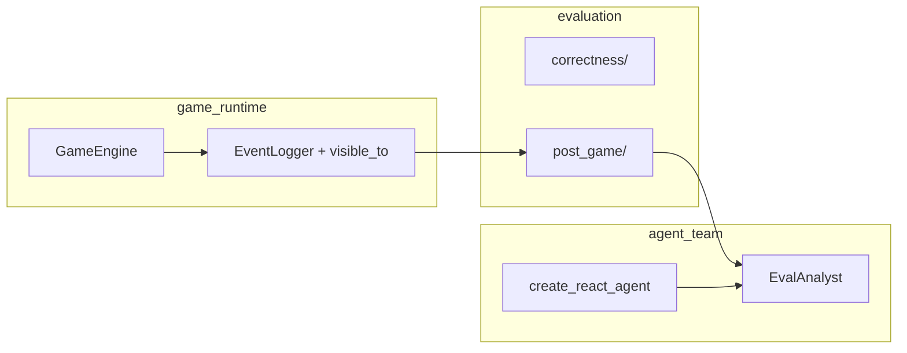

# 吕祎晗 - 测评模块设计（Evaluation v2）

> **读者**：规则 / Agent / Prompt / 评测全体队友  
> **状态**：Phase 1 + MVP 已落地（2026-05-26）；Phase 2 待做见 §12  
> **代码根目录**：`src/llm_werewolf/evaluation/`  
> **原则**：评测 LLM 统一走 **AgentScope**；**不改**运行时 v2 Prompt（产物均为 JSON/MD draft）  
> **文档索引**（`docs/` 仅维护四份）：[发现问题](./吕祎晗-发现问题.md) · [修改记录](./吕祎晗-修改记录.md) · **本文** · [工程架构重构计划](./工程架构重构计划.md)

---

## 1. 为什么拆成两个子包

| 子包 | 路径 | 回答的问题 | 触发方式 |
| --- | --- | --- | --- |
| **correctness** | `evaluation/correctness/` | 引擎/规则/信息隔离/阶段流是否正确 | `werewolf-eval`（DemoAgent，无需 API Key） |
| **post_game** | `evaluation/post_game/` | 这局打得怎么样、谁 MVP、怎么调 Prompt/Skill | `finalize_run`（真实对局）；`werewolf-vote-swing`（仅摇摆报告） |

```text
evaluation/
  correctness/          # runner, checkers, recorder, metrics, scenarios
  post_game/            # pipeline, scoring, log_views, skills, prompt_proposals
```

**不要混用**：correctness 用 Demo 跑批量回归；post_game 消费 `runs/<id>/events.jsonl` 做赛后分析。

---

## 2. 模块边界（与六模块架构）



| 模块 | 职责 | 禁止 |
| --- | --- | --- |
| `evaluation` | 离线 checker、赛后流水线、打分、JSON/MD 产物 | 直接 `AsyncOpenAI`；写入运行时 Prompt |
| `agent_team` | 提供评测用 ReActAgent（`eval_agent.py`） | 把评测业务逻辑散落到 factory |
| `strategy` | 复盘/Skill 的 Pydantic Schema | 评测计分逻辑 |
| `game_runtime` | `visible_to`、observation（只读复用） | PostGame 编排 |
| `interface` | `finalize_run`、CLI | — |

---

## 3. PostGame 流水线（当前实现）

对局结束 → `interface/finalize_run.py` → `run_post_game_pipeline`  
每步 **try/except**，状态写入 `post_game_steps.json`（单步失败不阻断后续规则步骤）。

| 序号 | step_id | 产物 | 说明 |
| --- | --- | --- | --- |
| 1 | `load_context` | — | 从 `events.jsonl` 加载 roster / 胜负 |
| 2 | `vote_swing` | `vote_swing_report.md` | 发言→意向摇摆 |
| 3 | `camp_persuasion` | `camp_persuasion_report.md` | 阵营匹配说服 |
| 4 | `log_views` | `views/` | god / POV / digest（**人读**；默认不喂复盘 LLM） |
| 5 | `intention_scores` | `intention_scores.json` | 意向分增强 |
| 6 | `score_contexts` | `views/score_contexts/` | **分维度隔离上下文**（见 §4） |
| 7 | `benefit_scores` | `benefit_scores.json` | 收益分 v2（**先于 MVP**） |
| 8 | `mvp_scores` | `mvp_scores.json` | 规则层 MVP（见 §5） |
| 9 | `llm_replay` | `post_game_analysis.json` | AgentScope 复盘（可选，`skip_llm` 跳过） |
| 10 | `game_quality_report` | `game_quality_report.md` | 人读总览 + 流水线表 |
| 11 | `prompt_proposals` | `prompt_proposals.json` | Prompt 补丁提案（见 §7） |
| 12 | `role_skills` | `role_skills.json`, `skills/*.md` | Skill 卡片（见 §8） |

**批量 correctness**：`correctness/runner.py` 在对局目录存在 `events.jsonl` 时也会跑 PostGame（`skip_llm=True`）。

---

## 4. 分维度上下文（信息隔离）

复盘 LLM 与规则计分 **禁止** 读取全量 `events.jsonl` / `god_timeline`。

| 维度 | 文件 | 材料范围 |
| --- | --- | --- |
| `persuasion` | `views/score_contexts/persuasion.md` | 白天公开发言、`channel=public` 投票意向 |
| `wolf_night` | `views/score_contexts/wolf_night.md` | `channel=wolf_team` 狼队讨论 + 当晚刀口 |
| `strategy` | `views/score_contexts/strategy.md` | 验人/用药/守护/票型等行为（无发言正文） |
| `outcome` | `views/score_contexts/outcome.md` | 投票、出局、死亡、胜负 |

实现：`post_game/scoring/score_contexts.py`；manifest 在 `views/score_contexts/manifest.json`。

---

## 5. MVP 量化（`mvp_scores_v2`）

**目标**：用规则层给出「谁本局贡献最大」，**全场 MVP 可为败方**。

### 5.1 维度与权重

各身份权重见 `post_game/scoring/role_weights.yaml`（含 `benefit` 维度，默认 8%，其余同比缩放）。

| 维度 | 含义 |
| --- | --- |
| `persuasion` | 公开讨论说服、意向摇摆（依赖 `vote_intentions.jsonl`） |
| `wolf_night` | 狼队夜间讨论质量（依赖 `channel=wolf_team`） |
| `strategy` | 角色技能/票型执行 |
| `outcome` | 归因投票、存活、胜负 |
| `benefit` | 来自 `benefit_scores_v2` 归一化 |

同身份内 min-max 归一化后加权合成 `mvp_total`；全场取最高分为 MVP。

### 5.2 金句

每位玩家可有 `golden_speech_candidates[]`（公开说服 / 狼夜计划），供 `prompt_proposals` 与 Skill 绑定。  
实现：`post_game/scoring/mvp.py`、`post_game/mvp_sources.py`。

### 5.3 收益分（`benefit_scores_v2`）

| 指标 | 说明 |
| --- | --- |
| `game_won` | 阵营获胜 |
| `elimination_aligned` | 放逐方向与阵营利益一致 |
| `camp_persuasion_sum` | 说服分和 |
| `survival_at_end` | 终局仍存活 |
| `strategy_night_actions` | 有效夜间技能次数 |

---

## 6. 日志视图（`log_views/`）

| 视图 | 用途 |
| --- | --- |
| `god_timeline.md` | 裁判全量（checker 对照） |
| `player_player_*_timeline.md` | 当局者 POV（`visible_to` 过滤） |
| `role_*_timeline.md` | 按 prompt 身份聚合 |
| `public_digest.md` / `swing_digest.json` | 压缩摘要 |

---

## 7. Prompt 提案（`prompt_proposals_v2`）

**不写入运行时**，仅 JSON draft；人工审阅后改 `strategy/prompts/v2/`。

| `kind` | 来源 | 优先级 |
| --- | --- | --- |
| `mvp_golden_speech` / `golden_speech` | MVP 金句摘录 | 高 |
| `llm_suggestion` | 复盘 Agent 结构化建议 | 中 |
| `positive_persuasion` | 无金句时 camp 说服回退 | 中 |
| `bad_case_rule` | `PromptBadCaseChecker` | 低 |

每条提案含：`mvp_binding`、`background`、`applicable_scenario`、`citations[]`（指向 run 内文件）。

实现：`post_game/prompt_proposal.py`。

---

## 8. Skill 卡片（`role_skills_v2`）

**规则门控生成**（Phase 1 不按 benefit 阈值筛选；Phase 2 再筛）。

| 来源 `source_kind` | 生成条件 |
| --- | --- |
| `persuasion_speech` | 发言 ≥8 字 + 阵营匹配摇摆 ≥1 |
| `night_action` | 有效夜间技能事件 + target |
| `mvp_golden_quote` | MVP 金句条目 |
| `wolf_night_plan` | 狼夜分析 `speech_total` ≥ 阈值 |

卡片字段：`skill_card.background`、`applicable_scenario`、`citations[]`；MD 双写：

- `runs/<id>/skills/*.md`（本局归档）
- `agent_team/skills/<role>/*.md`（运行时加载库，**MD 已 gitignore**）

运行时加载：`agent_team/skill_loader.py`。

---

## 9. Correctness 子包速查

```bash
uv run werewolf-eval --scenario smoke_6p_basic --games 3 --timeout_seconds 20 --output_dir eval_runs/manual-smoke
```

| Checker | 检查内容 |
| --- | --- |
| `RoleSkillChecker` | 技能事件结构化字段 |
| `InformationIsolationChecker` | 私有事件泄露（片段 ≥16 字才比对，降低误报） |
| `VictoryCheckerEvaluator` | 胜负一致 |
| `AsyncFlowChecker` | 阶段白名单（跳过重复 phase 日志） |
| `DecisionConsistencyChecker` | 决策与事件一致 |
| `PromptBadCaseChecker` | 空泛发言、重复验人等 |

产物：`eval_runs/<run>/manifest.json`、`games/<id>/events.jsonl`、`checks.json` 等。

---

## 10. 2026-05 改动摘要（队友对齐用）

### 2026-05-26（MVP + 文档收口）

- 评测目录拆为 `correctness/` + `post_game/`
- MVP 五维打分 + 金句 → Prompt/Skill 绑定
- `benefit_scores_v2` 并入 MVP；流水线 benefit 先于 mvp
- `game_quality_report` + `post_game_steps.json` 分步容错
- `prompt_proposals` 支持 `llm_suggestion`；Skill v2 含背景/场景/引用
- 新增 `configs/llm-12p-doubao.yaml`、真测清单（见 §11）
- correctness runner：有 `events.jsonl` 即跑 PostGame

### 2026-05-25（Evaluation v2 Phase 1）

- Prompt 变量化 `strategy/prompts/v2/`
- PostGame 接入 `finalize_run`；LLM 复盘改 AgentScope（`eval_agent.py`）
- `log_views`、`intention_scores`、规则门控 Skill
- `run_context.py` roster 从多事件源补全（修复 prophet→villager 误映射）

---

## 11. 真实对局验收清单

### 跑局前

- [ ] YAML 中 `model` 非 demo/human，`api_key_env` 已在 `.env` 配置
- [ ] `prompt_version: v2`
- [ ] 投票意向追踪开启（产生 `vote_intention_snapshot`）

### 必查产物（`runs/<id>/`）

| 文件 | 期望 |
| --- | --- |
| `events.jsonl` | 全量事件 |
| `vote_intentions.jsonl` | 含 public； ideally 含 `wolf_team` |
| `mvp_scores.json` | `schema: mvp_scores_v2` |
| `benefit_scores.json` | `schema: benefit_scores_v2` |
| `views/score_contexts/*.md` | 四维度齐全 |
| `game_quality_report.md` | MVP + 排名 + 步骤表 |
| `post_game_steps.json` | 12 步状态 |
| `prompt_proposals.json` | 含金句或 llm_suggestion |
| `role_skills.json` | `schema: role_skills_v2` |

### 仅重跑 PostGame

```bash
cd MultiAgent-Werewolf
uv run python -c "
from pathlib import Path
from llm_werewolf.evaluation.post_game.pipeline import run_post_game_pipeline_sync
run_post_game_pipeline_sync(
    Path('runs/<run目录>'),
    config_path=Path('configs/llm-12p-doubao.yaml'),
    skip_llm=False,
)
"
```

### 真测脚本（整局 + 复盘）

```bash
uv run python scripts/run_game_with_replay.py configs/llm-12p-doubao.yaml 12p-doubao
```

---

## 12. 已知问题与 Phase 2

| 项 | 状态 | 说明 |
| --- | --- | --- |
| LLM 复盘 401 | 环境 | 需有效 `ARK_API_KEY` 与 EP 同账号；失败时 `post_game_analysis.json` 为 `mode: failed` |
| 投票意向全 `null` | Agent | 导致说服/MVP/金句链路失效；需修 Agent 输出落票 |
| 狼队频道未进 `vote_intentions` | 运行时 | `wolf_night` 维度、`wolf_night_plan` Skill 受影响 |
| MVP 败方偏高 | 规则 | 存活/benefit 权重待与胜方贡献再平衡 |
| Skill LLM 提取 | Phase 2 | 当前为规则 + 模板卡片 |
| benefit 阈值筛 Skill | Phase 2 | 未启用 |

---

## 13. 文件索引（实现入口）

| 能力 | 文件 |
| --- | --- |
| PostGame 编排 | `post_game/pipeline.py`, `pipeline_steps.py` |
| MVP | `post_game/scoring/mvp.py`, `role_weights.yaml` |
| 分维度上下文 | `post_game/scoring/score_contexts.py` |
| 收益分 | `post_game/scoring/benefit.py` |
| 质量报告 | `post_game/game_quality_report.py` |
| Prompt 提案 | `post_game/prompt_proposal.py` |
| Skill | `post_game/skill_extractor.py`, `skill_generation_rules.py`, `skill_md.py` |
| LLM 复盘 | `post_game/eval_agent.py` |
| 对局结束入口 | `interface/finalize_run.py` |
| 批量正确性 | `correctness/runner.py` |
| 测试 | `tests/evaluation/correctness/`, `tests/evaluation/post_game/` |

运行测试：

```bash
uv run pytest tests/evaluation -q --no-cov
```

---

## 14. 队友分工对接

| 你负责 | 请看 | 你会改/消费 |
| --- | --- | --- |
| 规则/引擎 | §9、`correctness/checkers.py` | `events.jsonl` 字段、`visible_to` |
| Agent | §11 已知问题 | 发言质量、意向落票、狼队频道 |
| Prompt | §7 | `prompt_proposals.json` → `strategy/prompts/v2/` |
| Skill 运营 | §8 | `role_skills.json`、`agent_team/skills/` |
| 评测/数据 | §3–§5 | `runs/` 产物、MVP 权重 YAML |

**Human 审阅入口**：`runs/<id>/game_quality_report.md` → 按需打开 `prompt_proposals.json`、`role_skills.json`、`views/score_contexts/`。
