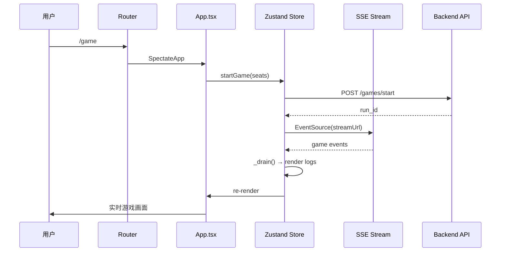

# 前端代码审查报告

> **审查分支**：`feat/engine-driven-spectate` 合并到 `main`
> **审查时间**：2026-06-06
> **审查范围**：`frontend/src/` 全部文件

---

## 一、Change Overview

---

## 二、问题清单

### P0 — 编译阻断

| No. | 问题 | 文件 | 行号 | 说明 |
|-----|------|------|------|------|
| 1 | 导入路径 `./lib/api` 不存在 | `store.ts` | L6 | 导入了 `API`, `fetchState`, `postControl`, `streamUrl`, `unwrap`，但 `src/lib/api.ts` 文件不存在。实际 API 文件在 `src/api/client.ts` 和 `src/api/game.ts` |
| 2 | 导入路径 `./lib/api-keys` 不存在 | `store.ts` | L7 | 导入了 `getApiKey`, `providerById`，但 `src/lib/api-keys.ts` 文件不存在，运行时直接崩溃 |

### P1 — 架构混乱

| No. | 问题 | 文件 | 行号 | 说明 |
|-----|------|------|------|------|
| 3 | 两套独立的观战 API 体系 | `SpectatePanel.tsx` vs `store.ts` | 全文 | `SpectatePanel` + `useSpectate` 走 `/api/v1/games/start` REST 轮询；`App.tsx` + `store.ts` 走 `${API}/games/start` + SSE 直连。两套 API 路径不一致，后端需要同时维护两套接口，容易不同步 |
| 4 | 路由命名与组件职责混淆 | `Router.tsx` | L15 | `/game` 路由挂载 `SpectateApp`（即 `App.tsx`），但 `SpectatePanel.tsx` 作为独立观战组件没有被任何路由使用。`/replay/:runId` 路由挂载的是 `PlaceholderPage`，复盘功能未实现 |

### P2 — 内存泄漏风险

| No. | 问题 | 文件 | 行号 | 说明 |
|-----|------|------|------|------|
| 5 | `useSpectate` 轮询 timer 快速调用泄漏 | `useSpectate.ts` | L48 | `startSpectate` 被快速连续调用时，`stopPolling()` 在函数开头调用，但 `setInterval` 是在 `try` 块内部创建的。如果 `refresh()` 抛异常后重试，前一个 timer 可能未被清除 |
| 6 | 拖拽事件监听器组件卸载时未清理 | `App.tsx` | L55-L57, L80-L81 | `startResizing` 和 `startResizingTouch` 中通过 `window.addEventListener` 注册了 `mousemove`/`mouseup`/`touchmove`/`touchend`，但没有 `useEffect` cleanup。如果用户拖拽过程中离开页面或组件卸载，监听器会残留 |

### P3 — 代码质量

| No. | 问题 | 文件 | 行号 | 说明 |
|-----|------|------|------|------|
| 7 | `store.ts` 中 `teardown()` 后 `set` 状态不一致 | `store.ts` | L56-61, L256-259 | `teardown()` 清理了 `eventSource`、`stateTimer`、`drainTimer`，但 `cancelGame` 和 `exitToSetup` 中各自重复调用 `set` 重置状态，逻辑分散。如果新增清理逻辑需要同步修改多处 |
| 8 | `App.tsx` 拖拽逻辑未封装为自定义 Hook | `App.tsx` | L38-L86 | 拖拽逻辑（mouse + touch）约 50 行，直接写在组件内。建议提取为 `useResizable(initialHeight, min, max)` Hook，提高可测试性 |
| 9 | `SpectatePanel` 中 `events.slice(-30)` 每次渲染都创建新数组 | `SpectatePanel.tsx` | L97 | React 严格模式下会导致子组件不必要的重渲染。建议用 `useMemo` 包裹 |
| 10 | `store.ts` 中全局变量 `stepPending` 非响应式 | `store.ts` | L38 | `stepPending` 是模块级变量，不在 Zustand store 状态树中。多个组件实例共享同一个变量，在 SSR 或多 store 场景下会有问题 |

---

## 三、文件完整性检查

| 文件 | 状态 | 备注 |
|------|------|------|
| `src/App.tsx` | 存在 | 游戏运行主界面 |
| `src/Router.tsx` | 存在 | 路由配置 |
| `src/store.ts` | 存在 | Zustand 状态管理 |
| `src/types.ts` | 存在 | 类型定义 |
| `src/api/client.ts` | 存在 | API 客户端基础层 |
| `src/api/game.ts` | 存在 | 游戏 API 封装 |
| `src/api/retry.ts` | 存在 | 重试逻辑 |
| `src/hooks/useSpectate.ts` | 存在 | 观战 Hook（REST 轮询） |
| `src/hooks/usePageData.ts` | 存在 | 页面数据 Hook |
| `src/components/SpectatePanel.tsx` | 存在 | 观战面板组件 |
| `src/lib/api.ts` | **不存在** | store.ts 导入但文件缺失 |
| `src/lib/api-keys.ts` | **不存在** | store.ts 导入但文件缺失 |

---

## 四、建议修复优先级

1. **立即修复**：问题 1 & 2（创建缺失的 `lib/api.ts` 和 `lib/api-keys.ts`，或修改 `store.ts` 导入路径指向 `api/` 目录）
2. **尽快修复**：问题 6（拖拽事件监听器泄漏）、问题 5（轮询 timer 泄漏）
3. **规划修复**：问题 3 & 4（统一观战 API 体系，明确路由职责）
4. **技术债**：问题 7-10（代码重构和优化）
